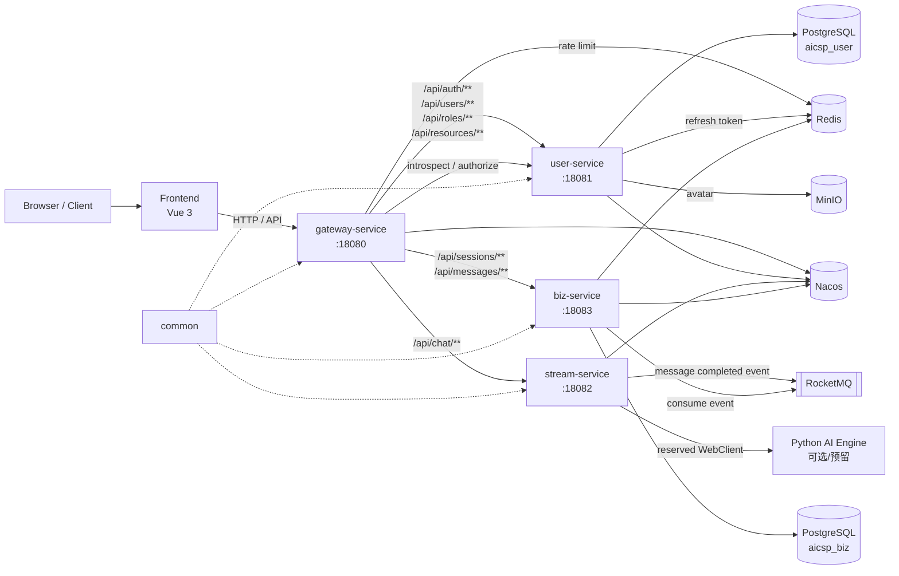
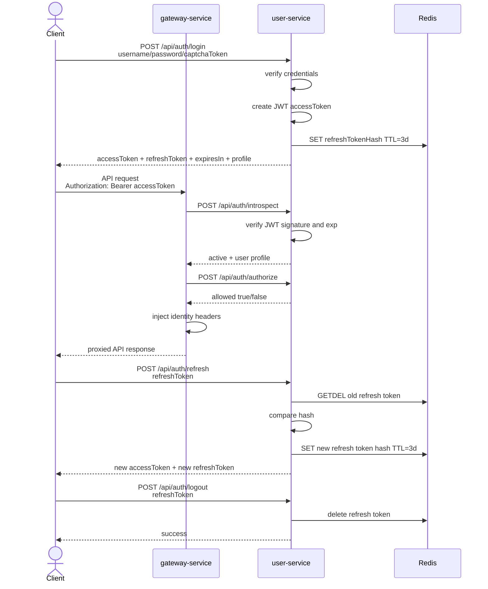
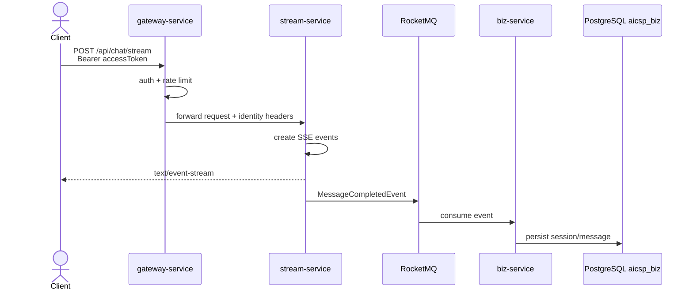

# AI Customer Service Platform

AI Customer Service Platform 是一个基于 Java 21、Spring Boot 3.5、Spring Cloud Gateway、Vue 3 的 AI 客服平台。当前项目采用多模块微服务结构，包含统一网关、用户与权限中心、流式对话服务、业务会话服务、公共模块和前端管理界面。

当前仓库以本地开发环境为主，`prod` 配置暂时与 `dev` 保持一致。上线前必须替换所有本地默认密码、JWT 密钥、内部调用 token 和对象存储凭据。

## 项目结构

```text
ai-customer-service-platform/
├── common/             # 公共返回体、异常、请求头常量、JSON 和 ID 工具
├── gateway-service/    # API 网关、鉴权过滤、限流、用户身份头透传
├── user-service/       # 认证、用户、角色、权限、资源、头像上传
├── stream-service/     # SSE 对话流、内部查询接口、RocketMQ 消息发布
├── biz-service/        # 会话、消息、RocketMQ 消息消费
├── frontend/           # Vue 3 + Element Plus 前端
├── docs/               # SDD 和开发文档
└── pom.xml             # Maven 多模块父工程
```

## 技术栈

| 层级 | 技术 |
| --- | --- |
| 后端语言 | Java 21 |
| 后端框架 | Spring Boot 3.5.13, Spring Cloud 2025.0.2 |
| 网关 | Spring Cloud Gateway WebFlux |
| 安全 | Spring Security, 自定义 JWT access token, Redis refresh token |
| 数据库 | PostgreSQL, Flyway, MyBatis |
| 缓存/会话 | Redis |
| 服务发现 | Nacos |
| 消息队列 | RocketMQ |
| 文件存储 | MinIO |
| 前端 | Vue 3, Vite, TypeScript, Pinia, Element Plus |

## 服务端口

| 服务 | 默认端口 | 说明 |
| --- | ---: | --- |
| `gateway-service` | `18080` | 外部统一入口 |
| `user-service` | `18081` | 认证、用户、RBAC |
| `stream-service` | `18082` | 流式聊天、内部查询 |
| `biz-service` | `18083` | 会话和消息 |
| `frontend` | `5173` | Vite 开发服务器默认端口 |
| Nacos | `8848` | 服务注册发现 |
| Redis | `6379` | token、限流、缓存 |
| RocketMQ NameServer | `9876` | 消息队列 |
| MinIO | `9000` | 对象存储 API |

## 架构图



## 认证与授权数据流

当前认证采用 access token + refresh token：

- access token：JWT，默认有效期 `900` 秒，由 `user-service` 签发，网关通过 `/api/auth/introspect` 和 `/api/auth/authorize` 校验。
- refresh token：不透明随机 token，默认有效期 `259200` 秒，服务端仅在 Redis 中保存 hash；刷新时消费旧 refresh token 并签发新 token。
- 网关鉴权通过后会向下游写入 `X-User-Id`、`X-Tenant-Id`、`X-User-Roles`、`X-Internal-Token`。
- `user-service` 的非公开接口只接受带正确 `X-Internal-Token` 的网关内部请求，避免绕过网关访问。



## 对话数据流



## 本地环境准备

建议版本：

| 依赖 | 建议版本 |
| --- | --- |
| JDK | 21 |
| Maven | 3.9+ |
| Node.js | 20+ |
| PostgreSQL | 15+ / 17+ |
| Redis | 7.x |
| Nacos | 2.x |
| RocketMQ | 5.x |
| MinIO | 当前稳定版 |

需要准备两个数据库：

```sql
CREATE DATABASE aicsp_user;
CREATE DATABASE aicsp_biz;
```

当前 Flyway 使用 schema：

- `user-service`：`user_service`
- `biz-service`：`biz_service`

服务启动时会自动创建 schema 并执行迁移。

## 启动顺序

推荐顺序：

1. PostgreSQL
2. Redis
3. Nacos
4. RocketMQ
5. MinIO
6. `user-service`
7. `biz-service`
8. `stream-service`
9. `gateway-service`
10. `frontend`

## 后端启动

在项目根目录执行。

构建全部模块：

```bash
mvn clean package -P dev
```

运行单个服务：

```bash
mvn -pl user-service spring-boot:run
```

```bash
mvn -pl biz-service spring-boot:run
```

```bash
mvn -pl stream-service spring-boot:run
```

```bash
mvn -pl gateway-service spring-boot:run
```

也可以先打包，再运行对应 jar：

```bash
java -jar user-service/target/user-service-1.0.0-SNAPSHOT.jar
```

## 前端启动

```bash
cd frontend
npm install
npm run dev
```

前端环境变量示例：`frontend/.env.example`

```env
VITE_API_BASE_URL=/api
VITE_API_PROXY_TARGET=http://localhost:18080
```

本地开发时，前端通过 Vite 代理访问网关。生产部署时建议将 `VITE_API_BASE_URL` 指向实际网关入口。

## 关键配置项

### gateway-service

文件：

- `gateway-service/src/main/resources/application-dev.yml`
- `gateway-service/src/main/resources/application-prod.yml`

| 配置项 | 默认值 | 说明 |
| --- | --- | --- |
| `server.port` | `18080` | 网关端口 |
| `spring.data.redis.host` | `localhost` | Redis 地址 |
| `spring.data.redis.port` | `6379` | Redis 端口 |
| `spring.data.redis.password` | `123456` | Redis 密码 |
| `spring.cloud.nacos.discovery.server-addr` | `localhost:8848` | Nacos 地址 |
| `spring.cloud.nacos.discovery.namespace` | `dev` | Nacos 命名空间 |
| `gateway.security.introspect-uri` | `http://localhost:18081/api/auth/introspect` | token 内省接口 |
| `gateway.security.authorize-uri` | `http://localhost:18081/api/auth/authorize` | RBAC 授权接口 |
| `gateway.security.internal-token` | 本地固定值 | 网关转发给下游的内部 token |
| `gateway.security.rate-limit-per-minute` | `120` | 每分钟限流阈值 |
| `gateway.security.whitelist-prefixes` | `/api/auth/`, `/oauth2/`, `/actuator/health` | 免鉴权路径前缀 |

生产注意：`internal-token` 必须替换为高强度随机值，并与 `user-service` 的 `aicsp.security.internal-token` 保持一致。

### user-service

文件：

- `user-service/src/main/resources/application-dev.yml`
- `user-service/src/main/resources/application-prod.yml`

| 配置项 | 默认值 | 说明 |
| --- | --- | --- |
| `server.port` | `18081` | 用户服务端口 |
| `spring.datasource.url` | `jdbc:postgresql://localhost:5432/aicsp_user?currentSchema=user_service` | 用户库 |
| `spring.datasource.username` | `postgres` | 数据库用户名 |
| `spring.datasource.password` | `123456` | 数据库密码 |
| `spring.data.redis.database` | `1` | Redis DB |
| `spring.flyway.enabled` | `true` | 自动迁移 |
| `aicsp.admin.username` | `admin` | 默认管理员用户名 |
| `aicsp.admin.password` | `123456` | 默认管理员密码，本地开发用 |
| `aicsp.jwt.secret` | 本地固定值 | JWT HS256 签名密钥，至少 32 字节 |
| `aicsp.jwt.ttl-seconds` | `900` | access token 有效期 |
| `aicsp.jwt.refresh-ttl-seconds` | `259200` | refresh token 有效期 |
| `aicsp.jwt.refresh-token-bytes` | `32` | refresh token 随机字节数 |
| `aicsp.security.internal-token` | 本地固定值 | 接受网关内部调用的 token |
| `aicsp.resource.project-root` | 本地项目路径 | 资源同步扫描根目录 |
| `aicsp.minio.endpoint` | `http://localhost:9000` | MinIO 地址 |
| `aicsp.minio.access-key` | `minioadmin` | MinIO access key |
| `aicsp.minio.secret-key` | `minioadmin123` | MinIO secret key |
| `aicsp.minio.bucket` | `aicsp-user` | 用户头像 bucket |

生产注意：

- 不要使用默认管理员密码。
- 不要使用仓库中的 JWT secret。
- 不要使用仓库中的内部 token。
- MinIO 凭据必须替换。

### stream-service

文件：

- `stream-service/src/main/resources/application-dev.yml`
- `stream-service/src/main/resources/application-prod.yml`

| 配置项 | 默认值 | 说明 |
| --- | --- | --- |
| `server.port` | `18082` | 流式服务端口 |
| `rocketmq.name-server` | `localhost:9876` | RocketMQ NameServer |
| `rocketmq.producer.group` | `stream-service-producer` | 生产者组 |
| `python.engine.base-url` | `http://localhost:8000` | Python AI 引擎地址 |
| `python.engine.max-connections` | `200` | WebClient 最大连接数 |
| `python.engine.response-timeout` | `310000` | 响应超时 |
| `stream.sse.heartbeat-interval` | `15s` | SSE 心跳间隔 |
| `stream.sse.max-duration` | `300s` | SSE 最大持续时间 |
| `stream.internal-token` | `change-me` 或配置值 | 内部接口 token |

说明：当前 `stream-service` 使用 `StreamModuleProperties` 读取 `stream.internal-token`。请确保配置文件中使用 `stream.internal-token`，不要再使用旧的 `internal.token`。

### biz-service

文件：

- `biz-service/src/main/resources/application-dev.yml`
- `biz-service/src/main/resources/application-prod.yml`

| 配置项 | 默认值 | 说明 |
| --- | --- | --- |
| `server.port` | `18083` | 业务服务端口 |
| `spring.datasource.url` | `jdbc:postgresql://localhost:5432/aicsp_biz?currentSchema=biz_service` | 业务库 |
| `spring.datasource.username` | `postgres` | 数据库用户名 |
| `spring.datasource.password` | `123456` | 数据库密码 |
| `spring.data.redis.database` | `2` | Redis DB |
| `spring.flyway.enabled` | `true` | 自动迁移 |
| `rocketmq.name-server` | `localhost:9876` | RocketMQ NameServer |
| `rocketmq.consumer.group` | `biz-service-consumer` | 消费者组 |
| `aicsp.worker-id` | `2` | 分布式 ID worker id |

## 主要 API

所有业务接口建议通过网关访问：`http://localhost:18080`。

### 认证

| 方法 | 路径 | 说明 |
| --- | --- | --- |
| `GET` | `/api/auth/captcha` | 获取滑块验证码 |
| `POST` | `/api/auth/captcha/verify` | 校验滑块验证码 |
| `POST` | `/api/auth/register` | 注册 |
| `POST` | `/api/auth/register-with-avatar` | 带头像注册 |
| `POST` | `/api/auth/login` | 登录，返回 access token 和 refresh token |
| `POST` | `/api/auth/refresh` | refresh token 轮换刷新 |
| `POST` | `/api/auth/logout` | 登出并吊销 refresh token |
| `GET` | `/api/auth/me` | 当前用户信息 |
| `POST` | `/api/auth/introspect` | 网关内省 access token |
| `POST` | `/api/auth/authorize` | 网关 RBAC 授权 |

### 用户与权限

| 方法 | 路径 | 说明 |
| --- | --- | --- |
| `GET` | `/api/users` | 用户列表 |
| `POST` | `/api/users` | 创建用户 |
| `GET` | `/api/users/{userId}` | 用户详情 |
| `PUT` | `/api/users/{userId}` | 更新用户 |
| `PUT` | `/api/users/{userId}/avatar` | 更新头像 |
| `GET` | `/api/users/{userId}/roles` | 用户角色 |
| `PUT` | `/api/users/{userId}/roles` | 分配用户角色 |
| `GET` | `/api/roles` | 角色列表 |
| `POST` | `/api/roles` | 创建角色 |
| `GET` | `/api/resources` | API 资源列表 |
| `GET` | `/api/resources/tree` | API 资源树 |
| `POST` | `/api/resources/sync` | 从代码同步 API 资源 |
| `GET` | `/api/resources/roles/{roleId}` | 角色资源 |
| `PUT` | `/api/resources/roles/{roleId}` | 分配角色资源 |
| `GET` | `/api/permissions` | 权限列表 |

### 对话与业务

| 方法 | 路径 | 说明 |
| --- | --- | --- |
| `POST` | `/api/chat/stream` | SSE 流式聊天 |
| `GET` | `/api/sessions` | 会话列表 |
| `POST` | `/api/sessions` | 创建会话 |
| `GET` | `/api/messages` | 消息列表 |
| `GET` | `/internal/{functionName}` | stream-service 内部查询接口 |

## 测试与验证

后端相关模块：

```bash
mvn -pl common,user-service,gateway-service,stream-service -am test
```

全量后端：

```bash
mvn test
```

前端：

```bash
cd frontend
npm run type-check
npm run build
```

## 部署建议

本项目当前还处于本地开发阶段。部署到服务器时建议按以下顺序处理：

1. 使用独立 PostgreSQL、Redis、Nacos、RocketMQ、MinIO 实例。
2. 为每个服务建立独立配置文件或环境变量注入机制。
3. 替换所有默认密码、JWT secret、internal token、MinIO 密钥。
4. 禁止公网直接访问 `user-service`、`stream-service`、`biz-service`，只暴露 `gateway-service` 和前端。
5. 在网关或反向代理层启用 HTTPS。
6. Redis 开启认证；生产建议使用专用网络和访问控制。
7. 调整 `aicsp.resource.project-root` 为实际部署路径，或在生产关闭自动资源同步定时任务。
8. 使用进程管理工具或容器编排启动服务，例如 systemd、Docker Compose、Kubernetes。

## 生产安全检查清单

- [ ] `aicsp.admin.password` 已替换。
- [ ] `aicsp.jwt.secret` 已替换为高强度密钥。
- [ ] `gateway.security.internal-token` 与 `aicsp.security.internal-token` 已替换且一致。
- [ ] `stream.internal-token` 已替换。
- [ ] 数据库密码已替换。
- [ ] Redis 密码已替换。
- [ ] MinIO 凭据已替换。
- [ ] 只暴露网关和前端。
- [ ] 启用 HTTPS。
- [ ] 日志目录、上传目录、对象存储 bucket 已准备。

## 当前已知注意事项

- 当前 `prod` 配置暂时与 `dev` 保持一致，仅适合本地开发或内网联调。
- refresh token 依赖 Redis；Redis 不可用会导致登录、刷新和登出不可用。
- access token 过期后，前端会用 refresh token 调用 `/api/auth/refresh`，成功后自动重试一次原请求。
- `stream-service` 的 Python 引擎调用已有客户端配置，但实际业务流是否完全依赖 Python 引擎需要按后续业务实现继续确认。
- 前端 `vite build` 可能出现 chunk 超过 500 kB 的警告，不影响构建产物生成。
