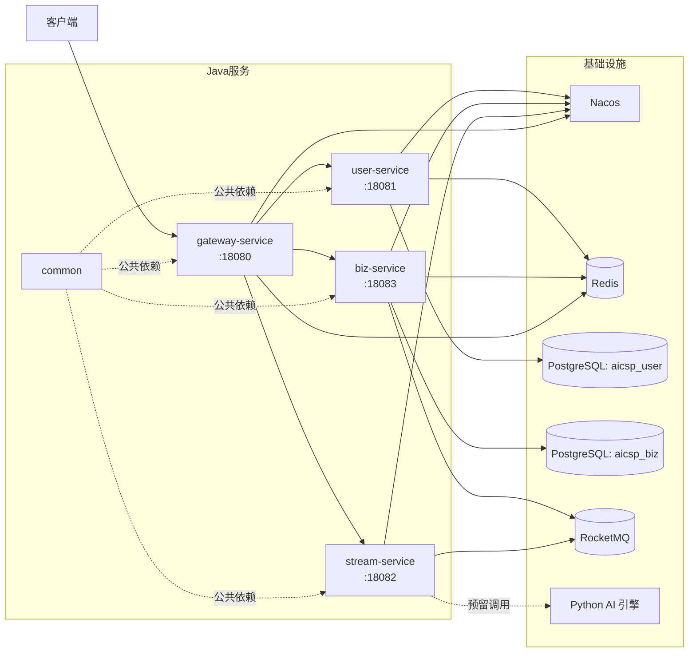
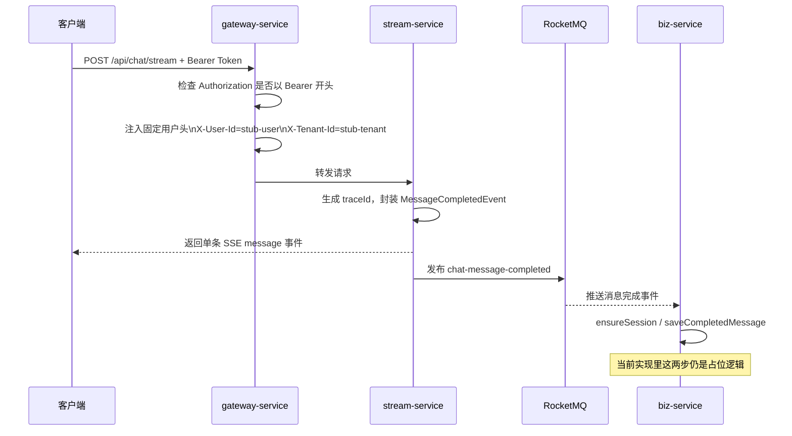
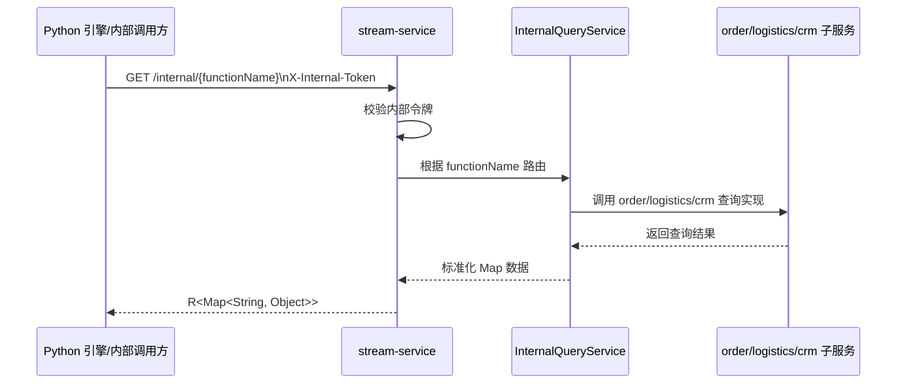

# ai-customer-service-platform

`ai-customer-service-platform` 是一个基于 Java 21、Spring Boot 3、Spring Cloud 的多模块 AI 客服平台后端工程。当前仓库已经搭好网关、用户中心、对话流服务、业务服务和公共模块的基础骨架，并预留了与 Python AI 引擎、RocketMQ、Nacos、PostgreSQL、Redis 的集成点。

需要先说明一个事实：从当前代码看，这个仓库更接近“可继续开发的微服务脚手架”，而不是“已经完整打通并可直接上线”的成品。README 以下内容以当前代码实现为准。

## 1. 项目结构

```text
ai-customer-service-platform/
├── pom.xml
├── common/             # 公共常量、通用返回体、异常、事件 DTO、工具类
├── gateway-service/    # 网关服务，负责统一入口和路由
├── user-service/       # 用户、角色、权限、授权服务
├── stream-service/     # 对话流服务，SSE 接口、内部查询接口、消息发布
├── biz-service/        # 会话与消息业务服务，消费 MQ 事件
└── docs/               # 设计文档
```

## 2. 技术栈

| 类别 | 技术 |
| --- | --- |
| 语言与构建 | Java 21, Maven |
| 基础框架 | Spring Boot 3.5.13, Spring Cloud 2025.0.2 |
| 服务治理 | Nacos |
| 网关 | Spring Cloud Gateway |
| 安全 | Spring Security, Spring Authorization Server |
| 数据访问 | MyBatis, Flyway, PostgreSQL |
| 缓存 | Redis |
| 消息队列 | RocketMQ |
| 响应式 | WebFlux, Reactor |
| 对象转换 | MapStruct |
| 日志 | Logback |

## 3. 模块职责

| 模块 | 端口 | 主要职责 | 当前状态 |
| --- | --- | --- | --- |
| `common` | 无 | 公共常量、异常、返回体、事件 DTO、工具类 | 可复用 |
| `gateway-service` | `18080` | 路由转发、入口拦截、请求头透传 | 已有基础路由，鉴权仍是占位实现 |
| `user-service` | `18081` | 用户、角色、权限接口，授权服务入口 | 控制器已建，Service 多为占位实现 |
| `stream-service` | `18082` | SSE 对话接口、内部查询接口、消息事件发布 | 主链路已搭骨架，AI 引擎调用未真正接入主流程 |
| `biz-service` | `18083` | 会话、消息接口，消费对话完成事件 | 控制器和消费者已建，持久化逻辑仍是占位实现 |

## 4. 系统架构图

下面的图分成两层含义：

- 实线：当前代码中已经存在明确入口或依赖关系。
- 虚线：代码中已经预留了接口/客户端，但主流程还没有完全接上。



## 5. 核心数据流图

### 5.1 当前对话主链路

这是当前代码里最接近“完整链路”的部分，但仍然是简化版实现。



### 5.2 预留的内部数据查询链路

`stream-service` 已提供 `/internal/{functionName}` 入口，给 Python 引擎或其他内部调用方访问。



## 6. 当前代码现状说明

这一节很关键，建议在真正联调或部署前先看完。

1. `gateway-service` 当前并没有真正做 JWT 验签。它只检查请求头里是否存在 `Bearer ` 前缀，然后写入固定的 `stub-user`、`stub-tenant`、`ROLE_USER` 头。
2. `stream-service` 的 `ChatStreamServiceImpl` 当前没有真正调用 `PythonEngineClient`，而是直接把用户输入原样作为 SSE 消息返回，并把同样的内容写进消息完成事件。
3. `user-service` 和 `biz-service` 的多个 `ServiceImpl` 仍是占位实现，例如列表接口直接返回空集合，创建/保存方法还没有真正写库。
4. `stream-service` 中存在两套内部 token 配置思路：`internal.token` 与 `stream.internalToken`。当前真正被 `SecurityConfig` 使用的是 `internal.token`。
5. `stream-service` 的 `InternalTokenWebFilter` 依赖 `StreamModuleProperties`，但当前启动类没有显式注册这个配置属性类。按现状看，这一部分存在启动失败或配置不生效的风险，正式启动前应先核对。
6. `gateway-service` 中存在 `GatewayModuleProperties`，但当前主流程没有看到实际使用点。

如果你的目标是“先跑通一个最小骨架”，这个仓库是够用的；如果目标是“可联调、可演示、可上线”，还需要继续补完整体业务实现。

## 7. 本地启动前准备

### 7.1 必备环境

| 组件 | 建议版本 | 说明 |
| --- | --- | --- |
| JDK | 21 | 项目根 POM 固定为 Java 21 |
| Maven | 3.9+ | 多模块构建 |
| PostgreSQL | 17+ | `user-service` 和 `biz-service` 依赖，dev 环境使用 pgvector/pgvector:pg17 |
| Redis | 7.x | 网关、用户、业务服务依赖 |
| Nacos | 2.x | 网关路由使用 `lb://`，本地也建议启用服务注册发现 |
| RocketMQ | 5.x | `stream-service` 生产消息，`biz-service` 消费消息 |
| Python 引擎 | 可选但建议准备 | 当前主流程未真正调用，但已预留配置与客户端 |

### 7.2 推荐启动顺序

1. PostgreSQL
2. Redis
3. Nacos
4. RocketMQ
5. `user-service`
6. `biz-service`
7. `stream-service`
8. `gateway-service`

如果你后续要接 Python AI 引擎，再单独启动 Python 服务。

## 8. 各服务启动前需要修改哪些配置

下面只列“启动前最应该核对或修改”的项。

### 8.1 gateway-service

配置文件：

- `gateway-service/src/main/resources/application-dev.yml`
- `gateway-service/src/main/resources/application-prod.yml`

需要核对：

| 配置项 | dev 默认值 | 是否必须修改 | 说明 |
| --- | --- | --- | --- |
| `server.port` | `18080` | 按需 | 端口冲突时修改 |
| `spring.data.redis.host` | `localhost` | 视环境而定 | Redis 地址 |
| `spring.data.redis.port` | `6379` | 视环境而定 | Redis 端口 |
| `spring.data.redis.password` | `123456` | 通常需要 | dev Redis 已开启认证 |
| `spring.cloud.nacos.discovery.server-addr` | `localhost:8848` | 通常需要 | Nacos 地址 |
| `spring.cloud.nacos.discovery.namespace` | `dev` / `prod` | 建议核对 | 命名空间要和服务注册一致 |
| `spring.cloud.gateway.routes[*]` | 已内置 | 按需 | 路由前缀、目标服务名如有变化需要同步修改 |

补充说明：

- 当前网关路由目标使用 `lb://user-service`、`lb://stream-service`、`lb://biz-service`，因此本地联调通常离不开 Nacos。
- 当前鉴权逻辑仍是占位实现，如果要接真实 OAuth2/JWT，这部分代码还需要补完。

### 8.2 user-service

配置文件：

- `user-service/src/main/resources/application-dev.yml`
- `user-service/src/main/resources/application-prod.yml`

需要核对：

| 配置项 | dev 默认值 | 是否必须修改 | 说明 |
| --- | --- | --- | --- |
| `server.port` | `18081` | 按需 | 端口冲突时修改 |
| `spring.datasource.url` | `jdbc:postgresql://localhost:5432/aicsp_user` | 通常需要 | 数据库地址、库名 |
| `spring.datasource.username` | `postgres` | 通常需要 | 数据库用户名 |
| `spring.datasource.password` | `123456` | 通常需要 | dev 环境数据库密码 |
| `spring.data.redis.host` | `localhost` | 视环境而定 | Redis 地址 |
| `spring.data.redis.port` | `6379` | 视环境而定 | Redis 端口 |
| `spring.data.redis.password` | `123456` | 通常需要 | dev Redis 已开启认证 |
| `spring.data.redis.database` | `1` | 建议核对 | Redis DB 编号 |
| `spring.cloud.nacos.discovery.server-addr` | `localhost:8848` | 通常需要 | Nacos 地址 |
| `spring.cloud.nacos.discovery.namespace` | `dev` / `prod` | 建议核对 | 命名空间 |
| `spring.flyway.enabled` | `true` | 建议保留 | 启动时自动迁移用户库 |

补充说明：

- `user-service` 承担授权服务角色，但当前仓库里还没有完整的客户端注册、JWK 发布、JWT 签发联调闭环说明，真正接 OAuth2 前需要继续补。

### 8.3 biz-service

配置文件：

- `biz-service/src/main/resources/application-dev.yml`
- `biz-service/src/main/resources/application-prod.yml`

需要核对：

| 配置项 | dev 默认值 | 是否必须修改 | 说明 |
| --- | --- | --- | --- |
| `server.port` | `18083` | 按需 | 端口冲突时修改 |
| `spring.datasource.url` | `jdbc:postgresql://localhost:5432/aicsp_biz` | 通常需要 | 业务库地址、库名 |
| `spring.datasource.username` | `postgres` | 通常需要 | 数据库用户名 |
| `spring.datasource.password` | `123456` | 通常需要 | dev 环境数据库密码 |
| `spring.data.redis.host` | `localhost` | 视环境而定 | Redis 地址 |
| `spring.data.redis.port` | `6379` | 视环境而定 | Redis 端口 |
| `spring.data.redis.password` | `123456` | 通常需要 | dev Redis 已开启认证 |
| `spring.data.redis.database` | `2` | 建议核对 | Redis DB 编号 |
| `spring.cloud.nacos.discovery.server-addr` | `localhost:8848` | 通常需要 | Nacos 地址 |
| `rocketmq.name-server` | `localhost:9876` | 通常需要 | RocketMQ NameServer |
| `rocketmq.consumer.group` | `biz-service-consumer` | 一般保留 | 消费组名称 |
| `spring.flyway.enabled` | `true` | 建议保留 | 启动时自动迁移业务库 |

补充说明：

- 当前 `MessageCompletedConsumer` 已接入 RocketMQ 消费，但 `ensureSession` 和 `saveCompletedMessage` 还未真正持久化。

### 8.4 stream-service

配置文件：

- `stream-service/src/main/resources/application-dev.yml`
- `stream-service/src/main/resources/application-prod.yml`

需要核对：

| 配置项 | dev 默认值 | 是否必须修改 | 说明 |
| --- | --- | --- | --- |
| `server.port` | `18082` | 按需 | 端口冲突时修改 |
| `spring.cloud.nacos.discovery.server-addr` | `localhost:8848` | 通常需要 | Nacos 地址 |
| `rocketmq.name-server` | `localhost:9876` | 通常需要 | RocketMQ NameServer |
| `rocketmq.producer.group` | `stream-service-producer` | 一般保留 | 生产组名称 |
| `python.engine.base-url` | `http://localhost:8000` | 建议修改/核对 | Python 引擎地址 |
| `python.engine.max-connections` | `200` | 按需 | WebClient 连接池上限 |
| `python.engine.response-timeout` | `310000` | 按需 | SSE/长请求超时 |
| `stream.sse.heartbeat-interval` | `15s` | 按需 | SSE 心跳间隔 |
| `stream.sse.max-duration` | `300s` | 按需 | 单次流式响应最大时长 |
| `internal.token` | `dev-internal-secret` | 必须修改 | 内部接口令牌，生产必须替换 |

补充说明：

- 当前真正被 `SecurityConfig` 读取的是 `internal.token`。
- 代码里还存在 `stream.internalToken` 对应的配置类，但这套配置目前没有形成稳定、统一的生效链路，建议先统一成一套再部署。

## 9. 构建与运行

### 9.1 全量构建

```bash
mvn clean package -P dev
```

生产构建：

```bash
mvn clean package -P prod -DskipTests
```

### 9.2 单服务运行示例

```bash
mvn -pl user-service spring-boot:run
```

```bash
mvn -pl biz-service spring-boot:run
```

```bash
mvn -pl stream-service spring-boot:run
```

```bash
mvn -pl gateway-service spring-boot:run
```

## 10. 常用接口入口

| 服务 | 路径 | 说明 |
| --- | --- | --- |
| `gateway-service` | `/gateway/ping` | 网关探活接口 |
| `gateway-service` | `/api/users/**` | 转发到 `user-service` |
| `gateway-service` | `/api/roles/**` | 转发到 `user-service` |
| `gateway-service` | `/api/permissions/**` | 转发到 `user-service` |
| `gateway-service` | `/api/chat/**` | 转发到 `stream-service` |
| `gateway-service` | `/api/sessions/**` | 转发到 `biz-service` |
| `gateway-service` | `/api/messages/**` | 转发到 `biz-service` |
| `stream-service` | `/internal/{functionName}` | 内部查询接口 |

## 11. 建议的下一步

如果你准备继续把这个项目补成可联调版本，优先顺序建议如下：

1. 先修正 `stream-service` 的配置绑定问题，统一内部 token 配置来源。
2. 补齐 `user-service`、`biz-service` 的数据库读写逻辑。
3. 让 `stream-service` 主链路真正调用 `PythonEngineClient`。
4. 把 `gateway-service` 的鉴权从占位逻辑升级为真实 JWT 验签和用户信息透传。
5. 补充每个服务的集成测试和最小联调脚本。

## 12. 参考文档

- `docs/sdd/初始化Java服务.md`

这个文档比 README 更详细，适合继续做设计或补实现时参考。
