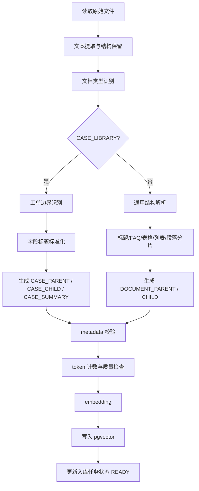

# RAG 分片策略设计文档（SDD）

**版本**：1.0.0  
**日期**：2026-04-26  
**适用范围**：`ai-engine` 知识库入库、分片、embedding、检索上下文组装  
**核心场景**：智能客服案例库 + 用户个人知识库

---

## 1. 目标

RAG 分片的目标不是“把文档切小”，而是把知识切成可检索、可溯源、可组合、能被模型稳定使用的信息单元。

本系统主要有两类知识来源：

1. 客服案例库：公共知识库的一种，`scope=PUBLIC` 且 `source_type=CASE_LIBRARY`。它通常是结构化工单，父级标题为工单号，例如 `T2026042600000001`，其下包含同级标题：
   - 问题描述（Question）
   - 问题根因（Reason）
   - 解决方案与措施
   - 备注（可选）
2. 个人知识库：用户自行上传的 PDF、Word、Markdown、HTML、TXT 等文档，格式不固定，可能是说明文、FAQ、会议纪要、操作手册、截图 OCR 文本或零散笔记。

设计目标：

- 对客服工单案例做结构化识别，保留“工单整体语义”和“字段级精确召回”。
- 对个人知识库做自适应解析，优先利用标题、列表、表格等结构，无法识别结构时再做语义/长度 fallback。
- 支持 Parent-Child 检索：小 chunk 用于召回，大 parent chunk 用于喂给模型。
- 每个 chunk 必须能回溯到文档、工单号、章节、字段、页码或位置。
- 检索时支持 `tenant_id`、`scope`、`owner_user_id`、`document_id`、`category_id`、`tag_id`、`status`、`enabled` 等元数据过滤。
- 降低语义割裂、跨工单污染、重复召回和幻觉风险。

---

## 2. 设计原则

### 2.1 结构优先

如果文档本身有标题层级、工单号、表格、列表、FAQ 问答结构，应先按结构切分，而不是直接按固定 token 长度切分。

优先级：

```text
明确业务结构 > 文档标题结构 > 表格/列表结构 > 语义边界 > 长度递归切分
```

### 2.2 工单不能被跨界切坏

客服案例库中，工单号是天然父级边界。不同工单之间不能合并到同一个 parent chunk，也不能因为长度相近而跨工单 overlap。

错误示例：

```text
chunk_001 = T2026042600000001 的解决方案后半段 + T2026042600000002 的问题描述前半段
```

这种 chunk 会导致检索命中后模型混淆根因和方案。

### 2.3 小 chunk 检索，大 chunk 注入

默认采用 Parent-Child 结构：

| 层级 | 作用 | 建议大小 |
|---|---|---|
| Document | 原始文件或知识条目 | 不限制 |
| Parent Chunk | 模型上下文注入单元 | 512~1200 token |
| Child Chunk | embedding 与召回单元 | 120~320 token |
| Atomic Span | 字段、段落、表格行等原子片段 | 不直接喂模型，辅助生成 child |

客服工单场景中：

- Parent Chunk 通常是一整个工单，或一个过长工单的“问题+根因”“方案+备注”两段。
- Child Chunk 通常是字段级片段，例如单独的问题描述、根因、方案步骤、备注。

### 2.4 元数据和内容同等重要

chunk 内容本身用于语义匹配，metadata 用于过滤、权限控制、溯源、排序和上下文组装。

不能只存文本向量，不存结构元数据。

### 2.5 不牺牲可解释性

每条召回结果至少能解释：

- 来自哪个文档？
- 来自哪个工单？
- 来自哪个字段？
- 为什么这个片段可能相关？
- 当前用户为什么有权访问？

---

## 3. 输入格式与预处理

### 3.1 支持格式

| 格式 | 处理方式 |
|---|---|
| Markdown | 保留标题层级、列表、代码块、表格 |
| HTML | 提取标题、段落、表格、列表，清理导航和样式 |
| Word | 转为结构化段落，识别标题样式 |
| PDF | 优先提取文本和页码；扫描件后续接 OCR |
| TXT | 按规则、空行、标题模式识别结构 |
| CSV/Excel | 第一阶段不作为主要案例格式；后续按行或表格记录切分 |

### 3.2 文本清洗

清洗只做“不会改变语义”的操作：

- 统一换行符为 `\n`。
- 去除页眉页脚、重复水印、目录页码噪声。
- 合并异常断行，例如 PDF 中一句话被强制换行。
- 保留标题、编号、列表符号。
- 保留表格结构，转换为 Markdown table 或行级 key-value。
- 保留原始字符 offset、页码、段落序号，便于溯源。

禁止：

- 删除看似重复但可能有业务差异的段落。
- 自动改写用户原文。
- 把多个工单合并成一个连续段落。

### 3.3 文档类型识别

入库时先识别文档类型：

| 类型 | 判断依据 |
|---|---|
| `CASE_LIBRARY` | 客服案例库，属于公共知识库的一种；存在一个或多个 `T\d{16}` 工单号标题，且其下有问题/根因/方案等字段 |
| `FAQ` | 大量 `Q/A`、`问/答`、`问题/答案` 成对结构 |
| `MANUAL` | 标题层级明显，包含操作步骤、说明、注意事项 |
| `POLICY` | 包含条款、规则、适用范围、有效期等 |
| `NOTE` | 结构弱，短段落或个人笔记 |
| `UNKNOWN` | 无法可靠分类 |

不同类型使用不同 splitter。`CASE_LIBRARY` 优先级最高。业务归属上，客服案例库默认作为公共知识库维护，普通用户只读、可检索；新增、编辑、删除、发布、下线和重建索引默认仅允许管理员和超级管理员操作。客服案例库默认启用，启用/禁用这类知识库只能由超级管理员操作，管理员不能禁用或重新启用客服案例库。

---

## 4. 客服案例库结构化分片

### 4.1 标题结构约定

客服案例库一般结构：

```markdown
# T2026042600000001

## 问题描述
用户反馈支付成功后订单仍显示待支付。

## 问题根因
支付回调延迟，订单状态同步任务未及时执行。

## 解决方案与措施
1. 查询支付流水确认支付状态。
2. 手动触发订单状态同步。
3. 通知用户刷新订单页面。

## 备注
如超过 30 分钟仍未同步，转人工技术支持。
```

工单号规则：

```regex
^#{1,6}\s*(T\d{16})\s*$
```

也兼容纯文本标题：

```regex
^(T\d{16})\s*$
```

### 4.2 字段标题别名

不同用户可能用中文、英文或轻微变体，需要做标题标准化。

| 标准字段 | 可识别标题 |
|---|---|
| `QUESTION` | `问题描述`、`问题`、`Question`、`客户问题`、`用户问题`、`故障现象`、`现象描述` |
| `REASON` | `问题根因`、`根因`、`原因`、`Reason`、`Root Cause`、`原因分析` |
| `SOLUTION` | `解决方案与措施`、`解决方案`、`处理措施`、`解决措施`、`Solution`、`Action`、`处理步骤` |
| `REMARK` | `备注`、`补充说明`、`Remark`、`Note`、`注意事项` |

标准化后写入 metadata：

```json
{
  "case_field": "SOLUTION",
  "case_field_title": "解决方案与措施"
}
```

### 4.3 工单解析状态

每个工单解析后标记质量状态：

| 状态 | 条件 | 处理 |
|---|---|---|
| `COMPLETE` | 有工单号，且至少包含 `QUESTION` 和 `SOLUTION` | 正常入库 |
| `PARTIAL` | 有工单号，但缺少关键字段 | 入库，但降低质量分 |
| `MALFORMED` | 工单边界混乱或字段无法归属 | 尝试 fallback，记录警告 |
| `DUPLICATE` | 同一文档中重复工单号 | 后出现的标记重复，需人工确认或版本化 |

### 4.4 分片层级

客服案例库采用四层结构：

```text
Document
└── Case Parent Chunk: T2026042600000001
    ├── Child Chunk: CASE_SUMMARY
    ├── Child Chunk: QUESTION
    ├── Child Chunk: REASON
    ├── Child Chunk: SOLUTION_STEP_1
    ├── Child Chunk: SOLUTION_STEP_2
    └── Child Chunk: REMARK
```

### 4.5 Parent Chunk 设计

Parent Chunk 是注入 LLM 的主要上下文。

默认模板：

```text
工单号：T2026042600000001

【问题描述】
...

【问题根因】
...

【解决方案与措施】
...

【备注】
...
```

Parent Chunk metadata：

```json
{
  "chunk_type": "CASE_PARENT",
  "document_id": "doc_001",
  "case_id": "T2026042600000001",
  "tenant_id": "default",
  "scope": "PUBLIC",
  "owner_user_id": null,
  "status": "READY",
  "enabled": true,
  "category_id": "cat_after_sales",
  "tag_ids": ["tag_payment", "tag_order"],
  "product_line": "default",
  "source_type": "CASE_LIBRARY",
  "section_path": ["T2026042600000001"],
  "quality": "COMPLETE"
}
```

大小控制：

| 情况 | 处理 |
|---|---|
| 整个工单 <= 1200 token | 一个 parent chunk |
| 工单 1200~2400 token | 拆成 `问题+根因`、`方案+备注` 两个 parent，互相关联 |
| 工单 > 2400 token | 按字段和方案步骤拆 parent，保留 `case_id` 和 sibling 关系 |

### 4.6 Child Chunk 设计

Child Chunk 用于 embedding 检索。

字段级 child：

```text
工单号：T2026042600000001
字段：问题描述
内容：用户反馈支付成功后订单仍显示待支付。
```

方案步骤 child：

```text
工单号：T2026042600000001
字段：解决方案与措施
步骤：2
内容：手动触发订单状态同步。
```

为什么 child 要带工单号和字段名：

- 用户常按“订单待支付”“支付成功不同步”提问，字段名能增强匹配。
- 同一段“刷新页面”如果脱离工单上下文，语义太弱。
- 工单号便于溯源和去重。

Child Chunk metadata：

```json
{
  "chunk_type": "CASE_CHILD",
  "parent_chunk_id": "parent_doc001_T2026042600000001",
  "document_id": "doc_001",
  "case_id": "T2026042600000001",
  "case_field": "SOLUTION",
  "case_field_order": 3,
  "section_path": ["T2026042600000001", "解决方案与措施"],
  "token_count": 86,
  "position": {
    "page_start": 3,
    "page_end": 3,
    "char_start": 1200,
    "char_end": 1460
  }
}
```

### 4.7 CASE_SUMMARY Chunk

每个完整工单生成一个摘要 chunk，用于高层语义召回。

生成方式：

- 第一阶段可使用规则拼接，不依赖 LLM。
- 后续可由 LLM 生成 80~150 字摘要，但必须保留原文 chunk 作为证据。

规则摘要模板：

```text
工单 T2026042600000001：用户问题是“支付成功后订单仍显示待支付”；根因为“支付回调延迟，状态同步任务未及时执行”；解决措施包括“查询支付流水、触发订单状态同步、通知用户刷新订单页面”。
```

适用场景：

- 用户问题短、口语化。
- 需要先命中案例，再展开 parent。
- 多字段都很短，单字段 embedding 信息不足。

关联规则：

- `CASE_SUMMARY` 是召回用 child chunk，`parent_chunk_id` 必须指向对应工单的 `CASE_PARENT`。
- 如果一个工单因过长拆成多个 `CASE_PARENT`，`CASE_SUMMARY` 指向覆盖工单核心问题与方案的主 parent，并通过 `sibling_parent_chunk_ids` 关联其它 parent。
- 检索命中 `CASE_SUMMARY` 后，走与 `CASE_CHILD` 相同的 parent 聚合与注入流程，不直接把摘要作为唯一上下文喂给模型。

### 4.8 方案字段过长的切法

解决方案字段可能包含长步骤、多个场景或表格。处理规则：

1. 如果有有序列表，按步骤分组；分组优先按 token 上限合并相邻步骤，目标区间与第 11.1 节 `CASE_CHILD` 一致。
2. 每个 child 尽量包含一个完整步骤或一组强相关步骤；相邻步骤合并后不得超过 380 token。
3. 单个步骤超过 320 token 时，按句子边界切分。
4. 相邻步骤不做默认 overlap，但可在 child 前添加“前置上下文”。

示例：

```text
字段：解决方案与措施
步骤 1：确认订单号和支付流水号。
步骤 2：查询支付渠道回调状态。
步骤 3：如回调成功但订单未更新，触发订单状态同步任务。
步骤 4：同步完成后通知用户刷新页面。
```

生成：

```text
SOLUTION_STEP_1_2: 步骤 1 + 步骤 2
SOLUTION_STEP_3: 步骤 3
SOLUTION_STEP_4: 步骤 4
```

### 4.9 备注字段处理

备注通常信息密度不稳定：

- 如果备注短于 80 token，作为 parent 的一部分，同时生成一个 `REMARK` child。
- 如果备注包含限制条件、升级规则、风险提示，应提升权重。
- 如果备注是无意义文本，例如“无”“暂无”“N/A”，不生成 child，但保留在 parent metadata 中。

无意义备注判断：

```text
无 / 暂无 / N/A / NA / none / 空 / -
```

### 4.10 缺字段处理

| 缺失情况 | 处理 |
|---|---|
| 缺 `QUESTION` | 用工单标题附近第一段作为问题候选，标记 `inferred_question=true` |
| 缺 `REASON` | 不生成 `REASON` child，parent 中写“未提供” |
| 缺 `SOLUTION` | 仍入库但 `quality=PARTIAL`，检索时降权 |
| 只有工单号和一段正文 | 按段落切 child，`case_field=UNKNOWN` |

### 4.11 多工单文档切分示例

输入：

```markdown
# T2026042600000001
## 问题描述
支付成功后订单仍显示待支付。
## 问题根因
支付回调延迟。
## 解决方案与措施
触发订单状态同步。

# T2026042600000002
## 问题描述
优惠券无法使用。
## 问题根因
优惠券已过期。
## 解决方案与措施
告知用户有效期，符合补偿规则时发放新券。
```

输出 chunk：

```text
parent:T2026042600000001
child:T2026042600000001:summary
child:T2026042600000001:question
child:T2026042600000001:reason
child:T2026042600000001:solution

parent:T2026042600000002
child:T2026042600000002:summary
child:T2026042600000002:question
child:T2026042600000002:reason
child:T2026042600000002:solution
```

不会在两个工单之间创建 overlap。

---

## 5. 个人知识库自适应分片

个人知识库没有固定结构，需要更稳健的通用分片策略。

### 5.1 处理优先级

```text
标题层级分片
  -> FAQ 问答对分片
  -> 表格/列表分片
  -> 段落语义分片
  -> 递归长度分片
```

### 5.2 标题层级分片

适用于 Markdown、Word 标题、HTML h1~h6。

规则：

- 每个标题节点形成一个 section。
- section 的 parent chunk 包含标题路径和正文。
- 子标题内容不强行并入父标题，除非父标题正文为空。

标题路径示例：

```text
售后政策 > 退款规则 > 到账时间
```

child chunk 内容模板：

```text
标题路径：售后政策 > 退款规则 > 到账时间
内容：退款审核通过后通常 1-3 个工作日到账。
```

### 5.3 FAQ 问答对分片

识别模式：

```regex
^(Q|Question|问|问题)[:：]
^(A|Answer|答|答案)[:：]
```

或连续结构：

```text
问题：如何退款？
答案：进入订单详情页申请退款。
```

FAQ chunk：

```json
{
  "chunk_type": "FAQ_PAIR",
  "question": "如何退款？",
  "answer": "进入订单详情页申请退款。",
  "section_path": ["售后 FAQ"]
}
```

FAQ 问题和答案不拆开 embedding，因为用户通常用问题召回答案。

长答案处理：

- 当 `FAQ_PAIR` 的问题 + 答案总长不超过 380 token 时，保持问答整体 embedding。
- 当总长超过 380 token 时，额外生成一个 `FAQ_QUESTION_CHILD`，只包含问题、标题路径和必要短上下文，用于向量召回。
- 长答案对应的 `FAQ_PAIR` 作为 parent 保留完整答案；`FAQ_QUESTION_CHILD.parent_chunk_id` 指向该 `FAQ_PAIR`，召回后注入完整问答对。

### 5.4 表格分片

表格不能简单按行切，也不能整体无限放大。

处理策略：

| 表格类型 | 切分方式 |
|---|---|
| 小表格，<= 20 行 | 整表 parent，按行或行组 child |
| 大表格，> 20 行 | 表头 + 5~10 行一组 |
| key-value 表 | 每个 key-value 或相关 key-value 组一个 child |
| 对比表 | 保留表头，每行附带列名 |

行级 child 模板：

```text
表格：退款时效规则
列：支付方式=微信支付；退款时效=1-3 个工作日；备注=节假日顺延
```

必须把表头拼入每个 child，否则单行 embedding 会丢失列含义。

### 5.5 列表分片

列表分为步骤列表和普通要点列表。

步骤列表：

- 尽量保持连续步骤。
- 每个 child 包含 1~3 个步骤。
- 标明步骤范围。

普通要点：

- 语义相关的要点合并。
- 单个要点很长时按句子切分。

### 5.6 段落语义分片

无标题但段落清晰时：

- 按空行切段。
- 短段落合并到 120~320 token。
- 长段落按句子边界拆分。
- 句子边界优先使用 `。！？；.!?;`。

合并规则：

```text
如果当前 chunk < 120 token，继续合并下一段；
如果加入下一段后 <= 320 token，合并；
如果加入后 > 320 token，当前 chunk 截止。
```

overlap 规则：

- `SEMANTIC_CHILD` 的 10%~20% overlap 以原始段落为单位计算，优先复用相邻 chunk 的完整短段落或段落尾部自然句。
- 不按合并后的 token 位置做字符级硬 overlap，避免把语义不相关段落的开头混入当前 chunk。
- 单个原始段落过长并被按句子拆分时，才允许在同一原始段落内部按句子边界 overlap。

### 5.7 递归长度 fallback

完全无结构时使用递归分隔符：

```text
\n\n
\n
。！？；.!?;
，,、 
空格
字符长度硬切
```

硬切只作为最后手段，并标记：

```json
{
  "split_strategy": "RECURSIVE_LENGTH_FALLBACK",
  "hard_split": true
}
```

检索时可对 hard split chunk 略降权。

### 5.8 小文档处理

如果整个文档小于 500 token：

- 生成一个 `DOCUMENT_PARENT`。
- 生成 1 个或少量 child。
- 不做强行切分。

---

## 6. Chunk 类型定义

| chunk_type | 来源 | 用途 |
|---|---|---|
| `CASE_PARENT` | 客服工单 | 注入模型的完整工单上下文 |
| `CASE_SUMMARY` | 客服工单 | 高层语义召回 |
| `CASE_CHILD` | 客服工单字段 | 精确召回问题、根因、方案 |
| `DOCUMENT_PARENT` | 通用文档 | 注入模型的章节上下文 |
| `SECTION_CHILD` | 标题章节 | 标题路径 + 段落检索 |
| `FAQ_PAIR` | FAQ 文档 | 问答对召回 |
| `FAQ_QUESTION_CHILD` | 长 FAQ 文档 | 长答案 FAQ 的问题侧召回 |
| `TABLE_PARENT` | 表格 | 完整表格上下文 |
| `TABLE_ROW_CHILD` | 表格行/行组 | 表格精确召回 |
| `LIST_CHILD` | 步骤/列表 | 操作步骤召回 |
| `SEMANTIC_CHILD` | 无结构文档 | 段落语义召回 |

---

## 7. Metadata 设计

### 7.1 必填 metadata

每个 chunk 必须包含：

```json
{
  "chunk_id": "chk_001",
  "parent_chunk_id": "par_001",
  "document_id": "doc_001",
  "tenant_id": "default",
  "scope": "PUBLIC",
  "owner_user_id": null,
  "status": "READY",
  "enabled": true,
  "chunk_type": "CASE_CHILD",
  "source_type": "CASE_LIBRARY",
  "title": "售后政策案例库",
  "section_path": ["T2026042600000001", "解决方案与措施"],
  "content_hash": "sha256:...",
  "quality_score": 1.0,
  "token_count": 120,
  "language": "zh-CN",
  "created_at": "2026-04-26T20:00:00+08:00",
  "updated_at": "2026-04-26T20:00:00+08:00"
}
```

`owner_user_id` 约定：

- `scope=PUBLIC` 时必须为 `null`，表示不归属于单个用户，不得使用 `"0"`、空字符串或其它哨兵值。
- `scope=PERSONAL` 时必须为实际用户 ID。
- 权限过滤必须显式区分 `owner_user_id IS NULL` 的公共文档和 `owner_user_id = 当前用户` 的个人文档。

### 7.2 客服案例专用 metadata

```json
{
  "case_id": "T2026042600000001",
  "case_field": "SOLUTION",
  "case_field_title": "解决方案与措施",
  "case_quality": "COMPLETE",
  "inferred_question": false,
  "has_reason": true,
  "has_solution": true
}
```

### 7.3 位置 metadata

```json
{
  "position": {
    "page_start": 1,
    "page_end": 2,
    "char_start": 0,
    "char_end": 850,
    "block_index": 3
  }
}
```

### 7.4 权限 metadata

权限过滤必须依赖 metadata：

```json
{
  "tenant_id": "default",
  "scope": "PERSONAL",
  "owner_user_id": "u_001",
  "status": "READY",
  "enabled": true
}
```

检索条件：

```text
tenant_id = 当前租户
status = READY
enabled = true
AND (
  (scope = PUBLIC AND owner_user_id IS NULL)
  OR (scope = PERSONAL AND owner_user_id = 当前用户)
)
AND document_id/category_id/tag_id 与 knowledgeSelection 取交集
```

---

## 8. Chunk ID 与 Parent ID 规则

ID 必须稳定，便于重建索引、删除和幂等。

建议：

```text
chunk_id = sha256(document_id + case_id + chunk_type + section_path + ordinal)
parent_chunk_id = sha256(document_id + case_id + parent_section_path + parent_ordinal)
content_hash = sha256(normalized_content)
```

说明：

- `chunk_id` 是结构性稳定 ID，不包含 `content_hash`；同一文档、同一工单、同一结构位置重建后仍得到相同 ID。
- `content_hash` 单独存储，用于判断正文是否变化、是否需要重新 embedding。
- 重建索引时按稳定 `chunk_id` 幂等 upsert：`content_hash` 未变化则跳过向量重算，变化则更新正文、metadata 和 embedding。
- 重建任务完成后，将本轮未产出的旧 `chunk_id` 标记为 `deleted=true`，避免内容结构变化后留下孤儿向量。
- 文档删除时按 `document_id` 删除全部 chunk。
- 工单重建时可按 `case_id` 局部 upsert 和清理。

---

## 9. 入库流水线



---

## 10. 分片算法伪代码

### 10.1 主流程

```python
def chunk_document(document):
    text, blocks = extract_text_with_structure(document)
    doc_type = detect_document_type(text, blocks)

    if doc_type == "CASE_LIBRARY":
        chunks = chunk_case_library(document, blocks)
    else:
        chunks = chunk_generic_document(document, blocks, doc_type)

    chunks = validate_chunks(chunks)
    chunks = attach_permissions(chunks, document.metadata)
    chunks = attach_positions(chunks, blocks)
    return chunks
```

### 10.2 工单分片

```python
def chunk_case_library(document, blocks):
    cases = split_by_case_id(blocks, pattern=r"^T\d{16}$")
    result = []

    for case in cases:
        fields = normalize_case_fields(case)
        quality = assess_case_quality(fields)

        parent_chunks = build_case_parent_chunks(case.case_id, fields, quality)
        child_chunks = []

        child_chunks.append(build_case_summary_chunk(case.case_id, fields, quality))

        for field_name, field_content in fields.items():
            if is_meaningless(field_content):
                continue
            child_chunks.extend(split_case_field(case.case_id, field_name, field_content))

        link_parent_child(parent_chunks, child_chunks)
        result.extend(parent_chunks)
        result.extend(child_chunks)

    return result
```

### 10.3 通用文档分片

```python
def chunk_generic_document(document, blocks, doc_type):
    if has_heading_tree(blocks):
        return chunk_by_heading_tree(document, blocks)

    if has_faq_pairs(blocks):
        return chunk_faq_pairs(document, blocks)

    if has_tables(blocks):
        return chunk_tables_and_surrounding_text(document, blocks)

    paragraphs = split_paragraphs(blocks)
    if paragraphs:
        return chunk_by_semantic_paragraphs(document, paragraphs)

    return recursive_length_split(document.text)
```

---

## 11. Token 大小与 overlap 策略

### 11.1 默认大小

| 类型 | 目标 token | 最大 token | overlap |
|---|---:|---:|---:|
| `CASE_PARENT` | 512~1200 | 1400 | 工单之间 0 |
| `CASE_CHILD` | 120~320 | 380 | 字段内 10% |
| `CASE_SUMMARY` | 80~180 | 220 | 0 |
| `DOCUMENT_PARENT` | 512~1200 | 1400 | 章节之间 0~10% |
| `SECTION_CHILD` | 120~320 | 380 | 10%~20% |
| `FAQ_PAIR` | 80~300 | 380 | 0 |
| `FAQ_QUESTION_CHILD` | 40~120 | 160 | 0 |
| `TABLE_ROW_CHILD` | 80~300 | 380 | 表头重复，不做文本 overlap |
| `SEMANTIC_CHILD` | 120~320 | 380 | 10%~20% |

### 11.2 overlap 禁止规则

以下情况不做 overlap：

- 不同工单之间。
- 不同 FAQ 问答对之间。
- 不同表格行代表独立实体时。
- 不同权限 scope 或不同 owner_user_id 的内容之间。

### 11.3 overlap 允许规则

以下情况允许 overlap：

- 同一长字段内部。
- 同一长段落内部；`SEMANTIC_CHILD` 应以原始段落或句子边界为 overlap 单位。
- 同一章节下连续说明段。
- 操作手册的连续步骤，但 overlap 不应打乱步骤编号。

---

## 12. Contextual Chunking

为了避免 child chunk 过短导致语义不完整，每个 child 可添加 1 段短上下文前缀。

客服工单前缀：

```text
以下内容来自客服工单 T2026042600000001 的“解决方案与措施”字段，主题是支付成功后订单仍显示待支付。
```

个人文档前缀：

```text
以下内容来自文档《售后政策手册》的章节“退款规则 > 到账时间”。
```

前缀规则：

- 50~100 token。
- 不引入原文没有的新事实。
- 可以由规则生成；不强制 LLM 生成。
- 前缀参与 embedding，但最终引用展示时应能区分原文和系统生成前缀。

metadata：

```json
{
  "contextual_prefix": "...",
  "contextual_prefix_generated_by": "rule",
  "contextual_prefix_in_embedding": true
}
```

---

## 13. 检索与上下文组装的配合

### 13.1 检索返回 child，注入 parent

流程：

```text
用户 Query
  -> 检索 child chunks
  -> CASE_SUMMARY / FAQ_QUESTION_CHILD 按 child 处理
  -> 按 parent_chunk_id 聚合
  -> 对 parent 去重
  -> 选择 top parent
  -> 注入 LLM
```

`CASE_SUMMARY`、`FAQ_QUESTION_CHILD` 只承担召回入口职责，命中后必须展开到 `parent_chunk_id` 对应的 `CASE_PARENT` 或 `FAQ_PAIR`。如果 parent 已被下线、删除或 ACL 过滤拒绝，命中的 child 必须丢弃，不得单独注入。

### 13.2 工单召回组装

如果命中 `CASE_CHILD` 或 `CASE_SUMMARY`：

1. 找到对应 `CASE_PARENT`。
2. 注入完整工单或相关字段集合。
3. 引用来源展示工单号和字段。

引用示例：

```json
{
  "documentId": "doc_001",
  "caseId": "T2026042600000001",
  "field": "解决方案与措施",
  "title": "售后案例库",
  "score": 0.82
}
```

### 13.3 多字段命中合并

同一工单多个字段命中时：

- 合并为一个工单上下文。
- 字段命中分数可以累加或取最大值。
- 优先展示命中字段，而不是重复展示同一工单多次。

### 13.4 个人文档召回组装

个人文档命中：

- 如果 child 有明确 parent，注入 parent。
- 如果 parent 过大，只注入命中 child 前后相邻 sibling。
- 对 `TABLE_ROW_CHILD`，注入表头和命中行。

---

## 14. 质量评分

每个 chunk 在入库时生成质量分，并持久化到 `engine_chunk.quality_score`，用于检索排序微调。

### 14.1 工单质量

| 条件 | 分值影响 |
|---|---:|
| 有 `QUESTION` | +0.2 |
| 有 `SOLUTION` | +0.3 |
| 有 `REASON` | +0.1 |
| `SOLUTION` 包含明确步骤 | +0.1 |
| 缺 `SOLUTION` | -0.4 |
| 硬切分 | -0.2 |
| 字段无法识别 | -0.1 |

### 14.2 通用文档质量

| 条件 | 分值影响 |
|---|---:|
| 有标题路径 | +0.2 |
| FAQ pair 完整 | +0.2 |
| 表格保留表头 | +0.2 |
| chunk 过短且无上下文 | -0.2 |
| 硬切分 | -0.2 |
| OCR 置信度低 | -0.3 |

质量分只影响排序，不影响权限过滤。

### 14.3 持久化与分数融合

- 入库阶段计算 `quality_score`，建议归一化到 `0.0~1.2` 区间，默认值为 `1.0`。
- 检索阶段先完成 ACL、`status=READY`、`enabled=true` 和知识库选择过滤，再做分数融合。
- 基础融合公式建议为 `final_score = vector_score * quality_score`；如果引入 reranker，则使用 `final_score = rerank_score * quality_score`。
- `engine_retrieval_log.scores` 必须记录原始向量分、可选 rerank 分、`quality_score` 和加权后的 `final_score`，便于排查排序结果。

---

## 15. 数据库存储建议

### 15.1 engine_chunk

```sql
CREATE TABLE engine_chunk (
    id              BIGINT PRIMARY KEY,
    chunk_id        VARCHAR(96) NOT NULL,
    parent_chunk_id VARCHAR(96),
    document_id     VARCHAR(64) NOT NULL,
    tenant_id       VARCHAR(64) NOT NULL,
    scope           VARCHAR(16) NOT NULL,
    owner_user_id   VARCHAR(64) NULL,
    chunk_type      VARCHAR(32) NOT NULL,
    source_type     VARCHAR(32) NOT NULL,
    case_id         VARCHAR(32),
    case_field      VARCHAR(32),
    section_path    JSONB NOT NULL,
    content         TEXT NOT NULL,
    content_hash    VARCHAR(80) NOT NULL,
    metadata        JSONB NOT NULL,
    token_count     INTEGER NOT NULL,
    quality_score   NUMERIC(5,4) NOT NULL DEFAULT 1.0,
    status          VARCHAR(32) NOT NULL,
    enabled         BOOLEAN NOT NULL DEFAULT TRUE,
    created_at      TIMESTAMPTZ NOT NULL DEFAULT CURRENT_TIMESTAMP,
    updated_at      TIMESTAMPTZ NOT NULL DEFAULT CURRENT_TIMESTAMP,
    deleted         BOOLEAN NOT NULL DEFAULT FALSE,
    CONSTRAINT ck_engine_chunk_owner_scope CHECK (
        (scope = 'PUBLIC' AND owner_user_id IS NULL)
        OR (scope = 'PERSONAL' AND owner_user_id IS NOT NULL)
    )
);
```

索引：

```sql
CREATE UNIQUE INDEX uk_engine_chunk_id ON engine_chunk (chunk_id) WHERE deleted = FALSE;
CREATE INDEX idx_engine_chunk_doc ON engine_chunk (document_id) WHERE deleted = FALSE;
CREATE INDEX idx_engine_chunk_case ON engine_chunk (case_id) WHERE deleted = FALSE;
CREATE INDEX idx_engine_chunk_acl ON engine_chunk (tenant_id, scope, owner_user_id, status, enabled) WHERE deleted = FALSE;
CREATE INDEX idx_engine_chunk_public_acl ON engine_chunk (tenant_id, status, enabled) WHERE deleted = FALSE AND scope = 'PUBLIC' AND owner_user_id IS NULL;
```

公共文档查询必须使用 `owner_user_id IS NULL`，个人文档查询使用 `owner_user_id = 当前用户`；不得用空字符串或 `"0"` 兼容公共文档。

### 15.2 engine_embedding

```sql
CREATE TABLE engine_embedding (
    id          BIGINT PRIMARY KEY,
    chunk_id    VARCHAR(96) NOT NULL,
    model       VARCHAR(128) NOT NULL,
    dimensions  INTEGER NOT NULL,
    embedding   vector(768) NOT NULL,
    created_at  TIMESTAMPTZ NOT NULL DEFAULT CURRENT_TIMESTAMP,
    deleted     BOOLEAN NOT NULL DEFAULT FALSE
);
```

`vector(768)` 需要和实际 embedding 模型维度一致。如果更换模型维度，需要新建索引或按模型分表/分列管理。

---

## 16. 边界情况

### 16.1 工单号不在标题中

如果正文中出现 `工单号：T2026042600000001`，可识别为 case_id，但不一定作为边界。只有满足以下条件才作为边界：

- 当前行独立出现工单号；或
- 当前行是标题样式；或
- 工单号后紧跟问题/根因/方案字段。

### 16.2 一个工单多个问题

如果同一工单下出现多个问题描述：

- 保留同一 `case_id`。
- 生成 `QUESTION_1`、`QUESTION_2` child。
- Parent 中按原顺序保留。

### 16.3 一个方案适用多个问题

如果文档结构为多个问题共用一个解决方案：

- Parent 保持完整工单。
- 每个 question child 链接同一个 solution sibling。
- metadata 增加 `shared_solution=true`。

### 16.4 文档混合工单和说明

如果文档前半部分是说明，后半部分是工单：

- 说明部分按通用文档分片。
- 工单部分按 `CASE_LIBRARY` 分片。
- 同一 document_id 下允许多个 source_type chunk。

### 16.5 用户个人文档包含工单号

即使是个人知识库，只要识别到稳定工单结构，也使用客服工单 splitter；scope 仍是 `PERSONAL`，owner_user_id 仍是当前用户。

### 16.6 用户上传图片或扫描 PDF

第一阶段：

- 如果无法提取文本，状态设为 `FAILED`，提示“未提取到可检索文本”。

后续：

- 接入 OCR。
- OCR 结果写入 metadata `ocr_confidence`。
- OCR 置信度低的 chunk 排序降权。

---

## 17. 验证用例

### 17.1 客服案例库

| 用例 | 期望 |
|---|---|
| 单个完整工单 | 生成 1 个 parent、1 个 summary、多个字段 child |
| 多个工单连续出现 | 不跨工单 overlap |
| 缺备注 | 正常 COMPLETE 或 PARTIAL，不失败 |
| 缺解决方案 | 入库为 PARTIAL，检索降权 |
| 方案字段超长 | 按步骤或句子拆 child |
| 重复工单号 | 标记 DUPLICATE 或版本化处理 |

### 17.2 个人知识库

| 用例 | 期望 |
|---|---|
| Markdown 多级标题 | 按标题树生成 parent/child |
| FAQ 文档 | 问答对不拆开 |
| 大表格 | 表头重复到每个行组 child |
| 无结构 TXT | 按段落和递归长度 fallback |
| 小文档 | 不强行切碎 |
| 扫描 PDF 无文本 | 入库失败并返回明确原因 |

### 17.3 权限与选择范围

| 用例 | 期望 |
|---|---|
| 普通用户检索公共知识 | 允许 |
| 普通用户检索自己的个人知识 | 允许 |
| 普通用户指定他人 document_id | 后端剔除 |
| 文档状态 DISABLED | 不参与检索 |
| knowledgeSelection=NONE | 跳过 RAG |

---

## 18. 可观测性

每次入库记录：

| 字段 | 说明 |
|---|---|
| `document_id` | 文档 ID |
| `source_type` | CASE_LIBRARY / FAQ / MANUAL / NOTE / UNKNOWN |
| `split_strategy` | 使用的分片策略 |
| `case_count` | 识别到的工单数 |
| `parent_chunk_count` | parent 数量 |
| `child_chunk_count` | child 数量 |
| `failed_case_count` | 解析失败工单数 |
| `hard_split_count` | 硬切分数量 |
| `avg_child_token_count` | child 平均 token |
| `embedding_model` | embedding 模型 |
| `duration_ms` | 入库耗时 |

检索时记录：

| 字段 | 说明 |
|---|---|
| `query` | 必须脱敏或 hash，不得记录原始问题全文 |
| `selected_document_ids` | 用户选择范围 |
| `hit_chunk_ids` | 命中 child |
| `hit_parent_ids` | 注入 parent |
| `case_ids` | 命中工单 |
| `scores` | 原始向量分、rerank 分、`quality_score` 和加权后的 `final_score` |
| `filtered_by_acl_count` | 权限过滤数量 |

---

## 19. 与现有 SDD 的关系

本文件细化 `docs/sdd/初始化Python引擎层.md` 中 RAG 分块策略。原则保持一致：

- Java `biz-service` 管知识库业务元数据和权限。
- Python `ai-engine` 管文档解析、分片、embedding、向量检索。
- 用户问答时可以通过 `knowledgeSelection` 选择启用范围。
- 检索前必须执行权限元数据过滤。

---

## 20. 第一阶段落地建议

第一阶段优先实现：

1. Markdown/TXT 工单案例库 splitter。
2. 工单号 `T\d{16}` 边界识别。
3. `QUESTION`、`REASON`、`SOLUTION`、`REMARK` 字段识别。
4. `CASE_PARENT`、`CASE_CHILD`、`CASE_SUMMARY` 三类 chunk。
5. 通用文档标题/段落 fallback splitter。
6. 必填 metadata 和权限过滤字段。
7. 入库质量日志。

第二阶段再实现：

1. Word/PDF 高质量结构解析。
2. 表格智能分片。
3. OCR。
4. LLM contextual prefix。
5. Reranker 与质量分排序融合。
6. 重复工单版本管理。
