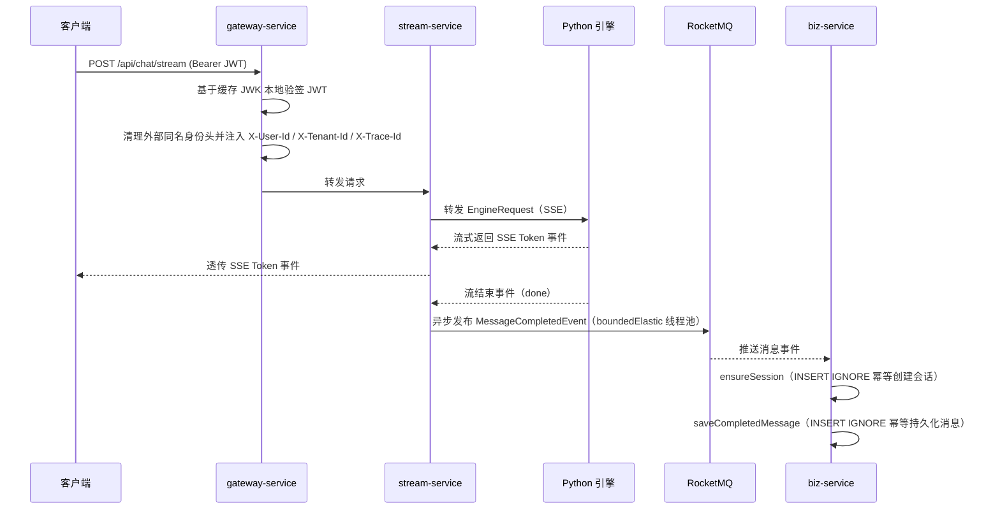
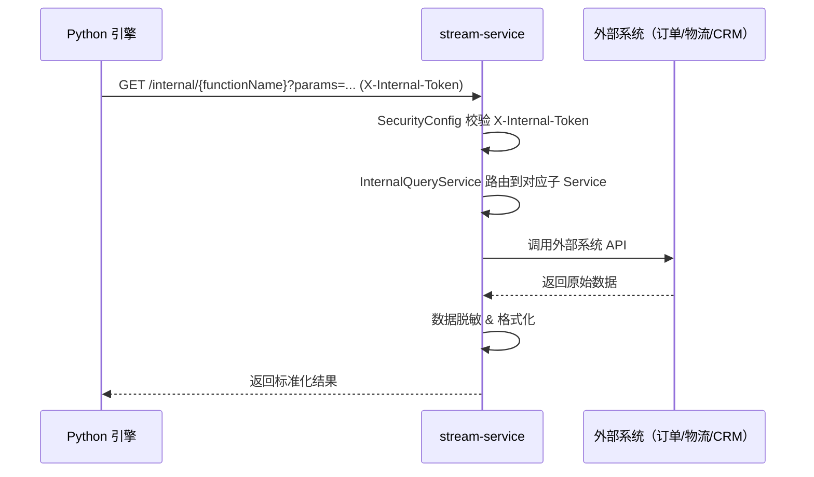
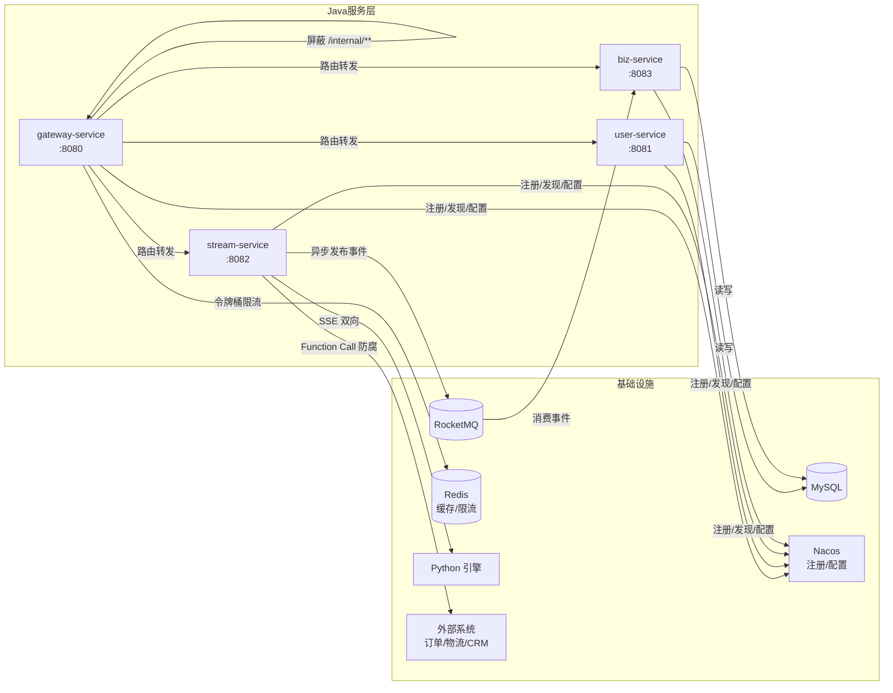

# ai-customer-service-platform — 软件设计文档（SDD）

**版本**：2.0.0
**日期**：2026-04-22
**技术基线**：Java 21 · Spring Boot 3.5.13 · Spring Cloud 2025.0.2 (Northfields)

---

## 1. 项目概述

`ai-customer-service-platform` 是一套面向企业级场景的智能客服平台后端工程，采用 Spring Cloud
微服务架构。本文档描述 Java 侧工程的模块划分、目录结构、依赖关系及各服务的职责边界。

Python AI 引擎层（`smart-cs-engine`）作为独立仓库单独管理，本文档不涉及。

---

## 2. 技术栈版本矩阵

| 组件 | 版本 | 说明 |
|------|------|------|
| Java | 21 (LTS) | 长期支持版本 |
| Spring Boot | 3.5.13 | 当前 3.x 最新稳定版 |
| Spring Cloud | 2025.0.2 (Northfields) | 对应 Spring Boot 3.5.x |
| Spring Cloud Gateway | 4.3.x | 基于 WebFlux 响应式栈 |
| Spring Security | 6.x | 随 Spring Boot 3.5 内置 |
| Spring Authorization Server | 1.x | OAuth2 授权服务器 |
| MyBatis | 3.5.x | `mybatis-spring-boot-starter` 3.0.4 |
| MapStruct | 1.5.5.Final | 编译期对象转换，替代 BeanUtils.copyProperties() |
| Lombok | 随 Spring Boot 内置管理 | 减少样板代码，需与 MapStruct 注解处理器顺序配合 |
| Logback | 1.5.x | Spring Boot 3.5 内置日志框架 |
| Maven | 3.9.x | 构建工具 |
| MySQL | 8.0+ | 关系型数据库 |
| Redis | 7.x | 缓存、限流 |
| RocketMQ | 5.x | 服务间异步解耦消息队列；`rocketmq-spring-boot-starter` 需使用已验证兼容 Spring Boot 3.5 的版本 |
| Nacos | 2.x | 服务注册与配置中心 |
| Flyway | 10.x | 数据库版本迁移 |

> **RocketMQ 版本兼容说明**：`rocketmq-spring-boot-starter` 官方适配范围截至
> Spring Boot 3.2.x，在 Spring Boot 3.5 环境下使用前须验证自动装配（`AutoConfiguration.imports`）
> 是否正常加载。若存在兼容问题，可考虑手动注册 `RocketMQTemplate` Bean 或等待官方适配版本发布。

---

## 3. 多环境策略总览

| 环境标识 | 用途 | Spring Profile | Maven Profile | 日志级别 |
|---------|------|---------------|--------------|---------|
| `dev` | 本地开发调试 | `dev` | `dev`（默认）| `DEBUG` |
| `prod` | 生产部署 | `prod` | `prod` | `INFO` |

**Maven Profile 与 Spring Profile 联动**：Maven 构建时通过资源过滤将
`@spring.profiles.active@` 替换为实际 Profile 值，注入到 `application.yml`
的 `spring.profiles.active` 字段，驱动 Spring Boot 加载对应的
`application-{profile}.yml` 及 `logback-spring.xml` 中对应的日志级别配置。

---

## 4. 服务总览

| 服务模块 | 端口 | 技术栈 | 核心职责 |
|---------|------|--------|---------|
| `common` | 无（库模块）| 纯 Java | 工具类、常量、通用 DTO、统一响应体 |
| `gateway-service` | 8080 | Spring Cloud Gateway · WebFlux | 统一入口、路由、OAuth2 令牌校验、限流 |
| `user-service` | 8081 | Spring MVC · Tomcat · MyBatis | 用户管理、RBAC 权限、OAuth2 授权服务器 |
| `stream-service` | 8082 | WebFlux · Reactor Netty | SSE 流式转发、Python 引擎中转、Function Call 防腐层 |
| `biz-service` | 8083 | Spring MVC · Tomcat · MyBatis | 会话管理、消息历史持久化、业务操作、RocketMQ 消费 |

---

## 5. 模块依赖关系

```
common（无 Spring Boot 依赖，纯工具库）
   ▲         ▲         ▲         ▲
   │         │         │         │
gateway   user-     stream-   biz-
service   service   service   service
```

所有业务服务均依赖 `common` 模块。`common` 模块本身不依赖任何业务服务，
也不引入 Spring Boot 的 Web、Security 等 Starter，保持轻量。

---

## 6. 数据流图

### 6.1 用户请求主链路（SSE 对话流）



### 6.2 Python 引擎 Function Call 防腐链路



### 6.3 服务间异步解耦总览



---

## 7. 工程结构总览

```
ai-customer-service-platform/
├── pom.xml                                          # 父 POM
│
├── common/                                          # 通用模块（库，不可独立部署）
│   ├── pom.xml
│   └── src/
│       └── main/
│           └── java/
│               └── com/aicsp/common/
│                   ├── constant/
│                   │   ├── RedisKeyConstants.java       # Redis Key 前缀常量
│                   │   ├── HeaderConstants.java         # HTTP 请求头名称常量（含 X-Internal-Token）
│                   │   ├── MessageStatusConstants.java  # 消息状态常量
│                   │   └── MQTopicConstants.java        # RocketMQ Topic/Tag 常量
│                   ├── result/
│                   │   ├── R.java                       # 统一响应体 R<T>（ok() 返回 R<Void>）
│                   │   └── ResultCode.java              # 业务状态码枚举
│                   ├── exception/
│                   │   ├── BizException.java            # 业务异常（bizMessage 字段，不遮蔽父类）
│                   │   ├── JsonException.java           # JSON 处理异常
│                   │   └── ErrorCode.java               # 错误码枚举（含 JSON_PROCESS_ERROR）
│                   ├── dto/
│                   │   └── event/
│                   │       └── MessageCompletedEvent.java  # RocketMQ 消息完成事件 DTO
│                   └── util/
│                       ├── JsonUtils.java               # Jackson 工具类（统一 ObjectMapper 配置）
│                       ├── TraceIdUtils.java            # Trace ID 生成工具
│                       └── DateUtils.java               # 日期格式化工具
│
├── gateway-service/                                 # 网关服务（WebFlux）
│   ├── pom.xml
│   └── src/
│       ├── main/
│       │   ├── java/
│       │   │   └── com/aicsp/gateway/
│       │   │       ├── GatewayApplication.java
│       │   │       ├── config/
│       │   │       │   ├── RouteConfig.java             # 路由规则、限流过滤器、屏蔽 /internal/**
│       │   │       │   ├── SecurityConfig.java
│       │   │       │   └── RedisConfig.java
│       │   │       ├── filter/
│       │   │       │   ├── AuthGlobalFilter.java
│       │   │       │   └── TraceIdGlobalFilter.java
│       │   │       └── handler/
│       │   │           └── GlobalExceptionHandler.java  # WebFlux 统一异常处理
│       │   └── resources/
│       │       ├── application.yml
│       │       ├── application-dev.yml
│       │       ├── application-prod.yml
│       │       └── logback-spring.xml
│       └── test/
│           └── java/
│               └── com/aicsp/gateway/
│                   └── GatewayApplicationTests.java
│
├── user-service/                                    # 用户与权限服务（Servlet）
│   ├── pom.xml
│   └── src/
│       ├── main/
│       │   ├── java/
│       │   │   └── com/aicsp/user/
│       │   │       ├── UserServiceApplication.java
│       │   │       ├── config/
│       │   │       │   ├── AuthorizationServerConfig.java
│       │   │       │   ├── SecurityConfig.java
│       │   │       │   ├── MyBatisConfig.java
│       │   │       │   └── RedisConfig.java
│       │   │       ├── controller/
│       │   │       │   ├── UserController.java
│       │   │       │   ├── RoleController.java
│       │   │       │   └── PermissionController.java
│       │   │       ├── service/
│       │   │       │   ├── UserService.java
│       │   │       │   ├── RoleService.java
│       │   │       │   ├── PermissionService.java
│       │   │       │   └── impl/
│       │   │       │       ├── UserServiceImpl.java
│       │   │       │       ├── RoleServiceImpl.java
│       │   │       │       └── PermissionServiceImpl.java
│       │   │       ├── mapper/
│       │   │       │   ├── UserMapper.java              # MyBatis 数据访问接口
│       │   │       │   ├── RoleMapper.java
│       │   │       │   ├── PermissionMapper.java
│       │   │       │   ├── UserRoleMapper.java
│       │   │       │   ├── RolePermissionMapper.java
│       │   │       │   └── converter/
│       │   │       │       ├── UserConverter.java       # MapStruct：User ↔ UserDTO / UserCreateRequest
│       │   │       │       ├── RoleConverter.java
│       │   │       │       └── PermissionConverter.java
│       │   │       ├── entity/
│       │   │       │   ├── User.java
│       │   │       │   ├── Role.java
│       │   │       │   ├── Permission.java
│       │   │       │   ├── UserRole.java
│       │   │       │   └── RolePermission.java
│       │   │       ├── dto/
│       │   │       │   ├── request/
│       │   │       │   │   ├── UserCreateRequest.java
│       │   │       │   │   ├── UserUpdateRequest.java
│       │   │       │   │   ├── RoleCreateRequest.java
│       │   │       │   │   └── AssignRoleRequest.java
│       │   │       │   └── response/
│       │   │       │       ├── UserDTO.java
│       │   │       │       ├── RoleDTO.java
│       │   │       │       └── PermissionDTO.java
│       │   │       ├── security/
│       │   │       │   └── UserDetailsServiceImpl.java
│       │   │       └── exception/
│       │   │           └── GlobalExceptionHandler.java  # Servlet 统一异常处理
│       │   └── resources/
│       │       ├── application.yml
│       │       ├── application-dev.yml
│       │       ├── application-prod.yml
│       │       ├── logback-spring.xml
│       │       ├── mapper/
│       │       │   ├── UserMapper.xml
│       │       │   ├── RoleMapper.xml
│       │       │   ├── PermissionMapper.xml
│       │       │   ├── UserRoleMapper.xml
│       │       │   └── RolePermissionMapper.xml
│       │       └── db/
│       │           └── migration/
│       │               ├── V1__init_schema.sql
│       │               └── V2__init_data.sql
│       └── test/
│           └── java/
│               └── com/aicsp/user/
│                   ├── UserServiceApplicationTests.java
│                   └── mapper/
│                       └── UserMapperTests.java
│
├── stream-service/                                  # SSE 流式转发服务（WebFlux）
│   ├── pom.xml
│   └── src/
│       ├── main/
│       │   ├── java/
│       │   │   └── com/aicsp/stream/
│       │   │       ├── StreamServiceApplication.java
│       │   │       ├── config/
│       │   │       │   ├── WebClientConfig.java
│       │   │       │   ├── SecurityConfig.java
│       │   │       │   └── RocketMQConfig.java
│       │   │       ├── controller/
│       │   │       │   ├── ChatStreamController.java    # SSE 流内异常用 onErrorResume 处理
│       │   │       │   └── InternalController.java
│       │   │       ├── service/
│       │   │       │   ├── ChatStreamService.java
│       │   │       │   ├── InternalQueryService.java
│       │   │       │   ├── internal/
│       │   │       │   │   ├── OrderQueryService.java
│       │   │       │   │   ├── LogisticsQueryService.java
│       │   │       │   │   ├── CrmQueryService.java
│       │   │       │   │   └── impl/
│       │   │       │   │       ├── OrderQueryServiceImpl.java
│       │   │       │   │       ├── LogisticsQueryServiceImpl.java
│       │   │       │   │       └── CrmQueryServiceImpl.java
│       │   │       │   └── impl/
│       │   │       │       ├── ChatStreamServiceImpl.java
│       │   │       │       └── InternalQueryServiceImpl.java
│       │   │       ├── client/
│       │   │       │   └── PythonEngineClient.java
│       │   │       ├── publisher/
│       │   │       │   └── MessageEventPublisher.java
│       │   │       ├── dto/
│       │   │       │   ├── request/
│       │   │       │   │   └── ChatRequest.java
│       │   │       │   ├── response/
│       │   │       │   │   └── SseTokenEvent.java
│       │   │       │   └── engine/
│       │   │       │       ├── EngineRequest.java
│       │   │       │       └── EngineEvent.java
│       │   │       └── exception/
│       │   │           └── GlobalExceptionHandler.java  # WebFlux 统一异常处理
│       │   └── resources/
│       │       ├── application.yml
│       │       ├── application-dev.yml
│       │       ├── application-prod.yml
│       │       └── logback-spring.xml
│       └── test/
│           └── java/
│               └── com/aicsp/stream/
│                   ├── StreamServiceApplicationTests.java
│                   └── client/
│                       └── PythonEngineClientTests.java
│
└── biz-service/                                     # 业务服务（Spring MVC）
    ├── pom.xml
    └── src/
        ├── main/
        │   ├── java/
        │   │   └── com/aicsp/biz/
        │   │       ├── BizServiceApplication.java
        │   │       ├── config/
        │   │       │   ├── MyBatisConfig.java
        │   │       │   ├── RedisConfig.java
        │   │       │   ├── RocketMQConfig.java
        │   │       │   └── SecurityConfig.java
        │   │       ├── controller/
        │   │       │   ├── SessionController.java
        │   │       │   └── MessageController.java
        │   │       ├── service/
        │   │       │   ├── SessionService.java
        │   │       │   ├── MessageService.java
        │   │       │   └── impl/
        │   │       │       ├── SessionServiceImpl.java
        │   │       │       └── MessageServiceImpl.java
        │   │       ├── consumer/
        │   │       │   └── MessageCompletedConsumer.java
        │   │       ├── mapper/
        │   │       │   ├── SessionMapper.java
        │   │       │   ├── MessageMapper.java
        │   │       │   └── converter/
        │   │       │       ├── SessionConverter.java    # MapStruct：Session ↔ SessionDTO
        │   │       │       └── MessageConverter.java    # MapStruct：Message ↔ MessageDTO / MessageCompletedEvent
        │   │       ├── entity/
        │   │       │   ├── Session.java
        │   │       │   └── Message.java
        │   │       ├── dto/
        │   │       │   ├── request/
        │   │       │   │   ├── SessionCreateRequest.java
        │   │       │   │   └── SessionUpdateRequest.java
        │   │       │   └── response/
        │   │       │       ├── SessionDTO.java
        │   │       │       └── MessageDTO.java
        │   │       └── exception/
        │   │           └── GlobalExceptionHandler.java
        │   └── resources/
        │       ├── application.yml
        │       ├── application-dev.yml
        │       ├── application-prod.yml
        │       ├── logback-spring.xml
        │       ├── mapper/
        │       │   ├── SessionMapper.xml
        │       │   └── MessageMapper.xml
        │       └── db/
        │           └── migration/
        │               ├── V1__init_schema.sql
        │               └── V2__init_data.sql
        └── test/
            └── java/
                └── com/aicsp/biz/
                    ├── BizServiceApplicationTests.java
                    └── consumer/
                        └── MessageCompletedConsumerTests.java
```

---

## 8. 父 POM 设计

### 8.1 坐标与模块声明

```xml
<groupId>com.aicsp</groupId>
<artifactId>ai-customer-service-platform</artifactId>
<version>1.0.0-SNAPSHOT</version>
<packaging>pom</packaging>

<modules>
    <module>common</module>
    <module>gateway-service</module>
    <module>user-service</module>
    <module>stream-service</module>
    <module>biz-service</module>
</modules>
```

### 8.2 全局版本属性

```xml
<properties>
    <java.version>21</java.version>
    <spring-boot.version>3.5.13</spring-boot.version>
    <spring-cloud.version>2025.0.2</spring-cloud.version>
    <mybatis-spring-boot.version>3.0.4</mybatis-spring-boot.version>
    <mysql.version>8.3.0</mysql.version>
    <flyway.version>10.21.0</flyway.version>
    <rocketmq-spring.version>2.3.1</rocketmq-spring.version>
    <mapstruct.version>1.5.5.Final</mapstruct.version>
    <lombok-mapstruct-binding.version>0.2.0</lombok-mapstruct-binding.version>
    <maven.compiler.source>21</maven.compiler.source>
    <maven.compiler.target>21</maven.compiler.target>
    <project.build.sourceEncoding>UTF-8</project.build.sourceEncoding>
    <spring.profiles.active>dev</spring.profiles.active>
</properties>
```

### 8.3 BOM 依赖管理

```xml
<dependencyManagement>
    <dependencies>
        <dependency>
            <groupId>org.springframework.boot</groupId>
            <artifactId>spring-boot-dependencies</artifactId>
            <version></version>
            <type>pom</type>
            <scope>import</scope>
        </dependency>
        <dependency>
            <groupId>org.springframework.cloud</groupId>
            <artifactId>spring-cloud-dependencies</artifactId>
            <version></version>
            <type>pom</type>
            <scope>import</scope>
        </dependency>
        <dependency>
            <groupId>org.apache.rocketmq</groupId>
            <artifactId>rocketmq-spring-boot-starter</artifactId>
            <version></version>
        </dependency>
        <dependency>
            <groupId>org.mapstruct</groupId>
            <artifactId>mapstruct</artifactId>
            <version></version>
        </dependency>
        <dependency>
            <groupId>com.aicsp</groupId>
            <artifactId>common</artifactId>
            <version></version>
        </dependency>
    </dependencies>
</dependencyManagement>
```

### 8.4 Maven Profile 定义

```xml
<profiles>
    <profile>
        <id>dev</id>
        <activation><activeByDefault>true</activeByDefault></activation>
        <properties><spring.profiles.active>dev</spring.profiles.active></properties>
        <build>
            <plugins>
                <plugin>
                    <groupId>org.apache.maven.plugins</groupId>
                    <artifactId>maven-surefire-plugin</artifactId>
                    <configuration><skipTests>false</skipTests></configuration>
                </plugin>
            </plugins>
        </build>
    </profile>
    <profile>
        <id>prod</id>
        <activation><activeByDefault>false</activeByDefault></activation>
        <properties><spring.profiles.active>prod</spring.profiles.active></properties>
        <build>
            <plugins>
                <plugin>
                    <groupId>org.apache.maven.plugins</groupId>
                    <artifactId>maven-surefire-plugin</artifactId>
                    <configuration><skipTests>true</skipTests></configuration>
                </plugin>
            </plugins>
        </build>
    </profile>
</profiles>
```

### 8.5 全局资源过滤与插件管理

> **重要**：Lombok 与 MapStruct 同时使用时，`annotationProcessorPaths` 中
> Lombok 必须声明在 MapStruct 之前，否则 MapStruct 无法识别 Lombok 生成的
> getter/setter，导致转换方法生成为空实现。

```xml
<build>
    <resources>
        <resource>
            <directory>src/main/resources</directory>
            <filtering>true</filtering>
        </resource>
    </resources>
    <pluginManagement>
        <plugins>
            <plugin>
                <groupId>org.springframework.boot</groupId>
                <artifactId>spring-boot-maven-plugin</artifactId>
                <version></version>
            </plugin>
            <plugin>
                <groupId>org.apache.maven.plugins</groupId>
                <artifactId>maven-compiler-plugin</artifactId>
                <configuration>
                    <source>21</source>
                    <target>21</target>
                    <encoding>UTF-8</encoding>
                    <annotationProcessorPaths>
                        <!-- Lombok 必须在 MapStruct 之前 -->
                        <path>
                            <groupId>org.projectlombok</groupId>
                            <artifactId>lombok</artifactId>
                            <version></version>
                        </path>
                        <path>
                            <groupId>org.projectlombok</groupId>
                            <artifactId>lombok-mapstruct-binding</artifactId>
                            <version></version>
                        </path>
                        <path>
                            <groupId>org.mapstruct</groupId>
                            <artifactId>mapstruct-processor</artifactId>
                            <version></version>
                        </path>
                    </annotationProcessorPaths>
                    <compilerArgs>
                        <!-- 生成的 Mapper 实现类自动标注 @Component，可直接注入 -->
                        <arg>-Amapstruct.defaultComponentModel=spring</arg>
                    </compilerArgs>
                </configuration>
            </plugin>
            <plugin>
                <groupId>org.apache.maven.plugins</groupId>
                <artifactId>maven-resources-plugin</artifactId>
                <configuration>
                    <delimiters><delimiter>@</delimiter></delimiters>
                    <useDefaultDelimiters>false</useDefaultDelimiters>
                </configuration>
            </plugin>
        </plugins>
    </pluginManagement>
</build>
```

---

## 9. common 模块设计

### 9.1 定位与约束

`common` 是纯 Java 库模块，**不是 Spring Boot 应用**，不包含 `@SpringBootApplication`，
不可独立部署。依赖范围严格控制，避免引入不必要的传递依赖。

### 9.2 pom.xml 核心依赖

```xml
<dependency>
    <groupId>com.fasterxml.jackson.core</groupId>
    <artifactId>jackson-databind</artifactId>
</dependency>
<dependency>
    <groupId>com.fasterxml.jackson.datatype</groupId>
    <artifactId>jackson-datatype-jsr310</artifactId>
</dependency>
<dependency>
    <groupId>org.slf4j</groupId>
    <artifactId>slf4j-api</artifactId>
</dependency>
<dependency>
    <groupId>org.projectlombok</groupId>
    <artifactId>lombok</artifactId>
    <scope>provided</scope>
</dependency>
<!-- common 不引入 spring-boot-starter-* 及 mapstruct（转换逻辑属于各业务服务） -->
```

### 9.3 各包职责与代码示例

**​`constant/` — 常量定义**

| 类 | 说明 |
|----|------|
| `RedisKeyConstants` |所有 Redis Key 前缀，如 `CHAT_SESSION_PREFIX = "chat:session:"` |
| `HeaderConstants` | 网关注入的请求头名称：`X_USER_ID`、`X_TENANT_ID`、`X_TRACE_ID`；这些头仅允许由网关重写注入；内网校验头：`X_INTERNAL_TOKEN = "X-Internal-Token"` |
| `MessageStatusConstants` | 消息状态值：`COMPLETED`、`INTERRUPTED` |
| `MQTopicConstants` | RocketMQ Topic 常量：`TOPIC_CHAT_MESSAGE_COMPLETED = "chat-message-completed"` |

**​`result/` — 统一响应体**

所有 HTTP 接口统一使用 `R<T>` 包装返回值，禁止在 Controller 层直接返回原始对象。
`ok()` 无参方法明确返回 `R<Void>`，避免泛型推断歧义。

```java
// common/src/main/java/com/aicsp/common/result/R.java

@Data
@NoArgsConstructor
@AllArgsConstructor
public class R<T> {

    private Integer code;
    private String message;
    private T data;

    public static <T> R<T> ok(T data) {
        return new R<>(ResultCode.SUCCESS.getCode(), ResultCode.SUCCESS.getMessage(), data);
    }

    /** 无数据成功响应，明确返回 R<Void> 避免泛型推断歧义 */
    public static R<Void> ok() {
        return new R<>(ResultCode.SUCCESS.getCode(), ResultCode.SUCCESS.getMessage(), null);
    }

    public static <T> R<T> fail(ResultCode resultCode) {
        return new R<>(resultCode.getCode(), resultCode.getMessage(), null);
    }

    public static <T> R<T> fail(Integer code, String message) {
        return new R<>(code, message, null);
    }
}
```

```java
// common/src/main/java/com/aicsp/common/result/ResultCode.java

@Getter
@AllArgsConstructor
public enum ResultCode {

    SUCCESS(200, "success"),
    BAD_REQUEST(400, "bad request"),
    UNAUTHORIZED(401, "unauthorized"),
    FORBIDDEN(403, "forbidden"),
    NOT_FOUND(404, "not found"),
    BIZ_ERROR(500, "business error"),
    SYSTEM_ERROR(503, "system error");

    private final Integer code;
    private final String message;
}
```

**​`exception/` — 异常定义**

`BizException` 中自定义字段重命名为 `bizMessage`，避免遮蔽父类 `getMessage()` 方法。
新增 `JsonException`，使 JSON 处理失败可被 `GlobalExceptionHandler` 统一捕获。

```java
// common/src/main/java/com/aicsp/common/exception/ErrorCode.java

@Getter
@AllArgsConstructor
public enum ErrorCode {

    USER_NOT_FOUND(1001, "用户不存在"),
    SESSION_NOT_EXIST(2001, "会话不存在"),
    ENGINE_TIMEOUT(3001, "AI 引擎响应超时"),
    INTERNAL_TOKEN_INVALID(4001, "内部调用 Token 无效"),
    PARAM_INVALID(400, "请求参数错误"),
    JSON_PROCESS_ERROR(5001, "JSON 处理失败");

    private final Integer code;
    private final String message;
}
```

```java
// common/src/main/java/com/aicsp/common/exception/BizException.java

@Getter
public class BizException extends RuntimeException {

    private final Integer code;
    /**
     * 业务错误信息，重命名为 bizMessage 避免遮蔽父类 getMessage()。
     * 调用方统一通过 getBizMessage() 获取业务描述。
     */
    private final String bizMessage;

    public BizException(ErrorCode errorCode) {
        super(errorCode.getMessage());
        this.code = errorCode.getCode();
        this.bizMessage = errorCode.getMessage();
    }

    public BizException(ErrorCode errorCode, String detail) {
        super(detail);
        this.code = errorCode.getCode();
        this.bizMessage = detail;
    }
}
```

```java
// common/src/main/java/com/aicsp/common/exception/JsonException.java

@Getter
public class JsonException extends RuntimeException {

    private final Integer code = ErrorCode.JSON_PROCESS_ERROR.getCode();
    private final String bizMessage;

    public JsonException(String detail, Throwable cause) {
        super(detail, cause);
        this.bizMessage = detail;
    }
}
```

**​`dto/event/` — 跨服务事件 DTO**

`@Builder`、`@NoArgsConstructor`、`@AllArgsConstructor` 三者必须同时声明：
`@Builder` 依赖全参构造器生成 Builder 类，Jackson 反序列化依赖无参构造器，缺一不可。

```java
// common/src/main/java/com/aicsp/common/dto/event/MessageCompletedEvent.java

@Data
@Builder
@NoArgsConstructor
@AllArgsConstructor
public class MessageCompletedEvent {

    /** 消息唯一标识（业务幂等键） */
    private String messageId;

    /** 会话 ID */
    private String sessionId;

    /** 用户 ID */
    private String userId;

    /** 租户 ID */
    private String tenantId;

    /** 用户原始消息 */
    private String userMessage;

    /**
     * AI 完整回复（流结束后拼接）。
     * 发布前须校验长度不超过 64KB，超出时截断并将 status 置为 INTERRUPTED。
     */
    private String aiReply;

    /** 消息状态：COMPLETED / INTERRUPTED */
    private String status;

    /** 链路追踪 ID（仅用于日志关联与问题排查） */
    private String traceId;

    /** 事件发生时间戳（毫秒） */
    private Long timestamp;
}
```

**​`util/` — 工具类**

`JsonUtils` 中 JSON 处理异常统一抛出 `JsonException`，可被各服务
`GlobalExceptionHandler` 捕获并返回标准错误响应。

```java
// common/src/main/java/com/aicsp/common/util/JsonUtils.java

public class JsonUtils {

    private static final ObjectMapper MAPPER = new ObjectMapper()
        .configure(DeserializationFeature.FAIL_ON_UNKNOWN_PROPERTIES, false)
        .setSerializationInclusion(JsonInclude.Include.NON_NULL)
        .setTimeZone(TimeZone.getTimeZone("Asia/Shanghai"))
        .registerModule(new JavaTimeModule())
        .disable(SerializationFeature.WRITE_DATES_AS_TIMESTAMPS);

    public static String toJson(Object obj) {
        try {
            return MAPPER.writeValueAsString(obj);
        } catch (JsonProcessingException e) {
            throw new JsonException("JSON 序列化失败: " + obj.getClass().getSimpleName(), e);
        }
    }

    public static <T> T fromJson(String json, Class<T> clazz) {
        try {
            return MAPPER.readValue(json, clazz);
        } catch (JsonProcessingException e) {
            throw new JsonException("JSON 反序列化失败: " + clazz.getSimpleName(), e);
        }
    }

    public static <T> T fromJson(String json, TypeReference<T> typeRef) {
        try {
            return MAPPER.readValue(json, typeRef);
        } catch (JsonProcessingException e) {
            throw new JsonException("JSON 反序列化失败: " + typeRef.getType().getTypeName(), e);
        }
    }
}
```

| 类 | 说明 |
|----|------|
| `JsonUtils` | 统一 ObjectMapper 配置，异常抛出 `JsonException`，禁止各服务自行构造 ObjectMapper |
| `TraceIdUtils` | 生成 UUID 格式的 Trace ID，供 `TraceIdGlobalFilter` 使用 |
| `DateUtils` | 日期格式化工具，统一时区（Asia/Shanghai）和格式规范 |

---

## 10. gateway-service — 网关服务

### 10.1 职责边界

| 职责 | 说明 |
|------|------|
| 路由转发 | 路由到 user-service / stream-service / biz-service |
| Token 验证 | 基于 user-service 发布的 JWK Set 在网关本地校验 JWT，避免逐请求调用 introspect |
| 身份注入 | 先清理外部同名身份头，再注入 `X-User-Id`、`X-Tenant-Id`、`X-User-Roles` |
| 链路追踪 | 使用 `TraceIdUtils` 生成并透传 `X-Trace-Id` |
| 全局限流 | Redis 令牌桶限流，由 `RouteConfig` 以代码方式配置，按路由维度设置速率 |
| SSE 透传 | `text/event-stream` 响应直接透传，不缓冲；连接生命周期由 stream-service 心跳与最大会话时长控制 |
| 内部接口屏蔽 | `RouteConfig` 对外部入站的 `/internal/**` 直接返回 404 |

### 10.2 核心依赖

```xml
spring-cloud-starter-gateway
spring-boot-starter-oauth2-resource-server
spring-cloud-starter-loadbalancer
spring-cloud-starter-alibaba-nacos-discovery
spring-boot-starter-data-redis-reactive
spring-boot-starter-actuator
com.aicsp:common
```

### 10.3 GlobalExceptionHandler（WebFlux）

```java
@RestControllerAdvice
@RequiredArgsConstructor
public class GlobalExceptionHandler {

    @ExceptionHandler(BizException.class)
    public Mono<R<?>> handleBizException(BizException e) {
        return Mono.just(R.fail(e.getCode(), e.getBizMessage()));
    }

    @ExceptionHandler(JsonException.class)
    public Mono<R<?>> handleJsonException(JsonException e) {
        return Mono.just(R.fail(e.getCode(), e.getBizMessage()));
    }

    @ExceptionHandler(Exception.class)
    public Mono<R<?>> handleException(Exception e) {
        return Mono.just(R.fail(ResultCode.SYSTEM_ERROR));
    }
}
```

### 10.4 application.yml（公共层）

```yaml
spring:
  profiles:
    active: @spring.profiles.active@
  application:
    name: gateway-service
logging:
  config: classpath:logback-spring.xml
management:
  endpoints:
    web:
      exposure:
        include: health,info
```

### 10.5 application-dev.yml

```yaml
server:
  port: 8080
spring:
  data:
    redis:
      host: localhost
      port: 6379
      database: 0
  cloud:
    nacos:
      discovery:
        server-addr: localhost:8848
        namespace: dev
    gateway:
      routes:
        - id: user-service
          uri: lb://user-service
          predicates:
            - Path=/api/users/**​, /api/roles/​**, /api/permissions/**​, /oauth2/​**
        - id: stream-service
          uri: lb://stream-service
          predicates:
            - Path=/api/chat/**
          metadata:
            response-timeout: -1
            connect-timeout: 5000
        - id: biz-service
          uri: lb://biz-service
          predicates:
            - Path=/api/sessions/**​, /api/messages/​**
      httpclient:
        response-timeout: 60s
        connect-timeout: 10000
# /internal/** 屏蔽规则及限流规则均由 RouteConfig.java 代码方式定义
# SSE 路由关闭网关响应超时，实际回收由 stream-service 的 heartbeat/max-duration 控制
```

### 10.6 application-prod.yml

```yaml
server:
  port: 8080
spring:
  data:
    redis:
      host:
      port:
      password:
      database: 0
  cloud:
    nacos:
      discovery:
        server-addr:
        namespace: prod
    gateway:
      routes:
        - id: user-service
          uri: lb://user-service
          predicates:
            - Path=/api/users/**​, /api/roles/​**, /api/permissions/**​, /oauth2/​**
        - id: stream-service
          uri: lb://stream-service
          predicates:
            - Path=/api/chat/**
          metadata:
            response-timeout: -1
            connect-timeout: 5000
        - id: biz-service
          uri: lb://biz-service
          predicates:
            - Path=/api/sessions/**​, /api/messages/​**
      httpclient:
        response-timeout: 30s
        connect-timeout: 5000
```

---

## 11. user-service — 用户与权限服务

### 11.1 核心依赖

```xml
spring-boot-starter-web
spring-boot-starter-security
spring-security-oauth2-authorization-server
mybatis-spring-boot-starter
spring-boot-starter-data-redis
spring-boot-starter-validation
spring-cloud-starter-alibaba-nacos-discovery
spring-boot-starter-actuator
mysql-connector-j
flyway-core
flyway-mysql
org.mapstruct:mapstruct
com.aicsp:common
```

### 11.2 Lombok 注解规范

```java
// Entity 类：MyBatis 反射实例化需要无参构造器
@Data
@NoArgsConstructor
@AllArgsConstructor
public class User {
    private Long id;
    private String userId;
    private String tenantId;
    private String username;
    private String password;
    private Integer status;
    private LocalDateTime createdAt;
    private LocalDateTime updatedAt;
}

// Request DTO：仅需无参构造器供 Spring MVC 反序列化
@Data
@NoArgsConstructor
public class UserCreateRequest {
    @NotBlank(message = "用户名不能为空")
    private String username;
    @NotBlank(message = "密码不能为空")
    private String password;
    @NotBlank(message = "租户 ID 不能为空")
    private String tenantId;
}

// Response DTO：Builder 模式供 Converter 构造
@Data
@NoArgsConstructor
@AllArgsConstructor
@Builder
public class UserDTO {
    private String userId;
    private String username;
    private String tenantId;
    private Integer status;
}

// Service Bean：@RequiredArgsConstructor 替代 @Autowired
@Service
@RequiredArgsConstructor
public class UserServiceImpl implements UserService {
    private final UserMapper userMapper;
    private final UserConverter userConverter;
}
```

### 11.3 MapStruct Converter

```java
// user-service/.../mapper/converter/UserConverter.java

@Mapper
public interface UserConverter {

    UserDTO toDTO(User user);

    @Mapping(target = "id",        ignore = true)
    @Mapping(target = "userId",    expression = "java(java.util.UUID.randomUUID().toString())")
    @Mapping(target = "status",    constant = "1")
    @Mapping(target = "createdAt", ignore = true)
    @Mapping(target = "updatedAt", ignore = true)
    User toEntity(UserCreateRequest request);

    List<UserDTO> toDTOList(List<User> users);
}
```

### 11.4 GlobalExceptionHandler（Servlet）

```java
@RestControllerAdvice
@RequiredArgsConstructor
public class GlobalExceptionHandler {

    @ExceptionHandler(BizException.class)
    public R<?> handleBizException(BizException e) {
        return R.fail(e.getCode(), e.getBizMessage());
    }

    @ExceptionHandler(JsonException.class)
    public R<?> handleJsonException(JsonException e) {
        return R.fail(e.getCode(), e.getBizMessage());
    }

    @ExceptionHandler(MethodArgumentNotValidException.class)
    public R<?> handleValidException(MethodArgumentNotValidException e) {
        String msg = e.getBindingResult().getFieldErrors().stream()
            .map(fe -> fe.getField() + ": " + fe.getDefaultMessage())
            .collect(Collectors.joining("; "));
        return R.fail(ResultCode.BAD_REQUEST.getCode(), msg);
    }

    @ExceptionHandler(Exception.class)
    public R<?> handleException(Exception e) {
        return R.fail(ResultCode.SYSTEM_ERROR);
    }
}
```

### 11.5 application-dev.yml

```yaml
server:
  port: 8081
spring:
  datasource:
    url: jdbc:mysql://localhost:3306/aicsp_user?useUnicode=true&characterEncoding=utf8&serverTimezone=Asia/Shanghai
    username: root
    password:
    driver-class-name: com.mysql.cj.jdbc.Driver
  data:
    redis:
      host: localhost
      port: 6379
      database: 1
  flyway:
    enabled: true
    locations: classpath:db/migration
    baseline-on-migrate: true
  cloud:
    nacos:
      discovery:
        server-addr: localhost:8848
        namespace: dev
mybatis:
  mapper-locations: classpath:mapper/*.xml
  configuration:
    map-underscore-to-camel-case: true
```

### 11.6 application-prod.yml

```yaml
server:
  port: 8081
spring:
  datasource:
    url:
    username:
    password:
    driver-class-name: com.mysql.cj.jdbc.Driver
  data:
    redis:
      host:
      port:
      password:
      database: 1
  flyway:
    enabled: true
    locations: classpath:db/migration
    baseline-on-migrate: true
  cloud:
    nacos:
      discovery:
        server-addr:
        namespace: prod
mybatis:
  mapper-locations: classpath:mapper/*.xml
  configuration:
    map-underscore-to-camel-case: true
```

---

## 12. stream-service — SSE 流式转发与 Function Call 防腐服务

### 12.1 职责边界

| 职责 | 说明 |
|------|------|
| SSE 流式转发 | 接收客户端请求，转发至 Python 引擎，透传 SSE Token 事件流；流内异常通过 `.onErrorResume()` 处理 |
| Function Call 防腐层 | 接收 Python 引擎的 `/internal/**` 回调，校验 `X-Internal-Token`，路由至对应子 Service |
| 消息事件发布 | 流结束后在 `Schedulers.boundedElastic()` 异步发布至 RocketMQ，避免阻塞 event loop |
| 身份透传 | 仅信任 gateway-service 重写注入的身份头，拒绝来自非网关来源的业务流量 |
| 连接治理 | 通过 SSE 心跳与最大会话时长回收长连接，避免无限占用连接池与 event loop 资源 |

### 12.2 核心依赖

```xml
spring-boot-starter-webflux
spring-boot-starter-security
spring-cloud-starter-alibaba-nacos-discovery
spring-boot-starter-actuator
rocketmq-spring-boot-starter
com.aicsp:common
```

### 12.3 SSE 流内异常处理示例

```java
// stream-service/.../controller/ChatStreamController.java

@RestController
@RequiredArgsConstructor
public class ChatStreamController {

    private final ChatStreamService chatStreamService;

    @PostMapping(value = "/api/chat/stream", produces = MediaType.TEXT_EVENT_STREAM_VALUE)
    public Flux<ServerSentEvent<String>> stream(@RequestBody ChatRequest request,
                                                ServerHttpRequest httpRequest) {
        return chatStreamService.stream(request, httpRequest)
            .onErrorResume(BizException.class, e ->
                Flux.just(ServerSentEvent.<String>builder()
                    .event("error")
                    .data(JsonUtils.toJson(R.fail(e.getCode(), e.getBizMessage())))
                    .build())
            )
            .onErrorResume(Exception.class, e ->
                Flux.just(ServerSentEvent.<String>builder()
                    .event("error")
                    .data(JsonUtils.toJson(R.fail(ResultCode.SYSTEM_ERROR)))
                    .build())
            );
    }
}
```

### 12.4 GlobalExceptionHandler（WebFlux）

```java
@RestControllerAdvice
@RequiredArgsConstructor
public class GlobalExceptionHandler {

    @ExceptionHandler(BizException.class)
    public Mono<R<?>> handleBizException(BizException e) {
        return Mono.just(R.fail(e.getCode(), e.getBizMessage()));
    }

    @ExceptionHandler(JsonException.class)
    public Mono<R<?>> handleJsonException(JsonException e) {
        return Mono.just(R.fail(e.getCode(), e.getBizMessage()));
    }

    @ExceptionHandler(Exception.class)
    public Mono<R<?>> handleException(Exception e) {
        return Mono.just(R.fail(ResultCode.SYSTEM_ERROR));
    }
}
```

### 12.5 异步发布说明

```java
// stream-service/.../publisher/MessageEventPublisher.java

@Component
@RequiredArgsConstructor
public class MessageEventPublisher {

    private static final int AI_REPLY_MAX_LENGTH = 65536;
    private final RocketMQTemplate rocketMQTemplate;

    public Mono<Void> publishCompleted(MessageCompletedEvent event) {
        return Mono.fromRunnable(() -> {
            if (event.getAiReply() != null
                    && event.getAiReply().length() > AI_REPLY_MAX_LENGTH) {
                event.setAiReply(event.getAiReply().substring(0, AI_REPLY_MAX_LENGTH));
                event.setStatus(MessageStatusConstants.INTERRUPTED);
            }
            rocketMQTemplate.convertAndSend(
                MQTopicConstants.TOPIC_CHAT_MESSAGE_COMPLETED, event);
        }).subscribeOn(Schedulers.boundedElastic()).then();
    }
}
```

### 12.6 application-dev.yml

```yaml
server:
  port: 8082
spring:
  cloud:
    nacos:
      discovery:
        server-addr: localhost:8848
        namespace: dev
rocketmq:
  name-server: localhost:9876
  producer:
    group: stream-service-producer
    send-message-timeout: 3000
python:
  engine:
    base-url: http://localhost:8000
    max-connections: 200
    acquire-timeout: 3000
    connect-timeout: 5000
    response-timeout: 310000
stream:
  sse:
    heartbeat-interval: 15s
    max-duration: 300s
internal:
  token: dev-internal-secret
```

### 12.7 application-prod.yml

```yaml
server:
  port: 8082
spring:
  cloud:
    nacos:
      discovery:
        server-addr:
        namespace: prod
rocketmq:
  name-server:
  producer:
    group: stream-service-producer
    send-message-timeout: 3000
python:
  engine:
    base-url:
    max-connections: 500
    acquire-timeout: 3000
    connect-timeout: 5000
    response-timeout: 310000
stream:
  sse:
    heartbeat-interval: 15s
    max-duration: 300s
internal:
  token:
```

---

## 13. biz-service — 业务服务

### 13.1 职责边界

| 职责 | 说明 |
|------|------|
| 会话管理 | 提供会话 CRUD HTTP 接口 |
| 消息历史 | 提供消息历史查询 HTTP 接口 |
| 消息持久化 | 消费 RocketMQ `chat-message-completed` Topic，幂等持久化对话消息至 MySQL |
| 业务扩展 | 承载后续新增的业务操作模块 |

### 13.2 核心依赖

```xml
spring-boot-starter-web
spring-boot-starter-security
mybatis-spring-boot-starter
spring-boot-starter-data-redis
spring-boot-starter-validation
spring-cloud-starter-alibaba-nacos-discovery
spring-boot-starter-actuator
rocketmq-spring-boot-starter
mysql-connector-j
flyway-core
flyway-mysql
org.mapstruct:mapstruct
com.aicsp:common
```

### 13.3 Lombok 注解规范

```java
// Entity
@Data
@NoArgsConstructor
@AllArgsConstructor
public class Session {
    private Long id;
    private String sessionId;
    private String userId;
    private String tenantId;
    private String title;
    private Integer status;
    private LocalDateTime createdAt;
    private LocalDateTime updatedAt;
}

@Data
@NoArgsConstructor
@AllArgsConstructor
public class Message {
    private Long id;
    private String messageId;
    private String sessionId;
    private String userId;
    private String tenantId;
    private String userMsg;
    private String aiReply;
    private String status;
    private String traceId;
    private LocalDateTime createdAt;
}

// Response DTO
@Data
@NoArgsConstructor
@AllArgsConstructor
@Builder
public class SessionDTO {
    private String sessionId;
    private String title;
    private Integer status;
    private LocalDateTime createdAt;
}

@Data
@NoArgsConstructor
@AllArgsConstructor
@Builder
public class MessageDTO {
    private String messageId;
    private String sessionId;
    private String userMsg;
    private String aiReply;
    private String status;
    private String traceId;
    private LocalDateTime createdAt;
}

// Service Bean
@Service
@RequiredArgsConstructor
public class SessionServiceImpl implements SessionService {
    private final SessionMapper sessionMapper;
    private final SessionConverter sessionConverter;
}
```

### 13.4 MapStruct Converter

```java
// biz-service/.../mapper/converter/SessionConverter.java

@Mapper
public interface SessionConverter {

    SessionDTO toDTO(Session session);

    @Mapping(target = "id",        ignore = true)
    @Mapping(target = "status",    constant = "1")
    @Mapping(target = "createdAt", ignore = true)
    @Mapping(target = "updatedAt", ignore = true)
    Session toEntity(SessionCreateRequest request);

    List<SessionDTO> toDTOList(List<Session> sessions);
}
```

```java
// biz-service/.../mapper/converter/MessageConverter.java

@Mapper
public interface MessageConverter {

    MessageDTO toDTO(Message message);

    @Mapping(target = "id",        ignore = true)
    @Mapping(target = "createdAt", ignore = true)
    @Mapping(source = "userMessage", target = "userMsg")
    Message fromEvent(MessageCompletedEvent event);

    List<MessageDTO> toDTOList(List<Message> messages);
}
```

### 13.5 GlobalExceptionHandler（Servlet）

```java
@RestControllerAdvice
@RequiredArgsConstructor
public class GlobalExceptionHandler {

    @ExceptionHandler(BizException.class)
    public R<?> handleBizException(BizException e) {
        return R.fail(e.getCode(), e.getBizMessage());
    }

    @ExceptionHandler(JsonException.class)
    public R<?> handleJsonException(JsonException e) {
        return R.fail(e.getCode(), e.getBizMessage());
    }

    @ExceptionHandler(MethodArgumentNotValidException.class)
    public R<?> handleValidException(MethodArgumentNotValidException e) {
        String msg = e.getBindingResult().getFieldErrors().stream()
            .map(fe -> fe.getField() + ": " + fe.getDefaultMessage())
            .collect(Collectors.joining("; "));
        return R.fail(ResultCode.BAD_REQUEST.getCode(), msg);
    }

    @ExceptionHandler(Exception.class)
    public R<?> handleException(Exception e) {
        return R.fail(ResultCode.SYSTEM_ERROR);
    }
}
```

### 13.6 RocketMQ 消费者

```java
@Component
@RocketMQMessageListener(
    topic = MQTopicConstants.TOPIC_CHAT_MESSAGE_COMPLETED,
    consumerGroup = "biz-service-consumer"
)
@RequiredArgsConstructor
public class MessageCompletedConsumer implements RocketMQListener<MessageCompletedEvent> {

    private final SessionService sessionService;
    private final MessageService messageService;

    @Override
    public void onMessage(MessageCompletedEvent event) {
        // 1. INSERT IGNORE 幂等创建会话，消除并发竞态窗口
        sessionService.ensureSession(
            event.getSessionId(), event.getUserId(), event.getTenantId());
        // 2. INSERT IGNORE 幂等持久化消息，基于 uk_message_id 唯一索引去重
        messageService.saveCompletedMessage(event);
    }
}
```

### 13.7 application-dev.yml

```yaml
server:
  port: 8083
spring:
  datasource:
    url: jdbc:mysql://localhost:3306/aicsp_biz?useUnicode=true&characterEncoding=utf8&serverTimezone=Asia/Shanghai
    username: root
    password:
    driver-class-name: com.mysql.cj.jdbc.Driver
  data:
    redis:
      host: localhost
      port: 6379
      database: 2
  flyway:
    enabled: true
    locations: classpath:db/migration
    baseline-on-migrate: true
  cloud:
    nacos:
      discovery:
        server-addr: localhost:8848
        namespace: dev
rocketmq:
  name-server: localhost:9876
  consumer:
    group: biz-service-consumer
mybatis:
  mapper-locations: classpath:mapper/*.xml
  configuration:
    map-underscore-to-camel-case: true
```

### 13.8 application-prod.yml

```yaml
server:
  port: 8083
spring:
  datasource:
    url:
    username:
    password:
    driver-class-name: com.mysql.cj.jdbc.Driver
  data:
    redis:
      host:
      port:
      password:
      database: 2
  flyway:
    enabled: true
    locations: classpath:db/migration
    baseline-on-migrate: true
  cloud:
    nacos:
      discovery:
        server-addr:
        namespace: prod
rocketmq:
  name-server:
  consumer:
    group: biz-service-consumer
mybatis:
  mapper-locations: classpath:mapper/*.xml
  configuration:
    map-underscore-to-camel-case: true
```

---

## 14. 异步消息设计

### 14.1 RocketMQ Topic 规划

| Topic | Producer | Consumer | 说明 |
|-------|----------|----------|------|
| `chat-message-completed` | stream-service | biz-service | SSE 流结束后，携带完整对话内容的消息完成事件 |

> Topic 命名规范：`{业务域}-{事件动词}-{状态}`，全小写中划线分隔。
> 后续如有新增业务事件，统一在此表追加。

---

## 15. 安全设计

### 15.1 鉴权链路总览

```
客户端
  └─ 携带 Bearer JWT
       └─ gateway-service（AuthGlobalFilter）
            ├─ 基于 user-service 发布的 JWK Set 本地验签 JWT
            ├─ 清理外部传入的 X-User-* / X-Tenant-* / X-Trace-Id 同名请求头
            ├─ 验证通过：重写注入 X-User-Id / X-Tenant-Id / X-User-Roles / X-Trace-Id
            └─ 验证失败：返回 401
```

### 15.2 各服务 Security 策略

| 服务 | 策略 |
|------|------|
| `gateway-service` | 拦截所有外部请求，使用 Resource Server 能力基于 JWK Set 本地验签 JWT；白名单放行 `/oauth2/token`、`/oauth2/jwks`、`/actuator/health`；对外部入站先清洗身份头，再由 `RouteConfig` 屏蔽 `/internal/**` |
| `user-service` | Spring Authorization Server 负责 Token 签发、JWK 发布与 introspection 能力；`/oauth2/**` 公开，其余管理接口仅允许受信内部调用 |
| `stream-service` | 不直接面向公网暴露业务入口；仅信任来自 gateway-service 的身份头；`/internal/**` 在应用层校验 `X-Internal-Token` 请求头 |
| `biz-service` | 不直接面向公网暴露；仅信任来自 gateway-service 的身份头，并通过网络策略限制来源 |

### 15.3 内网隔离与三层防护

- **网络层**：K8s NetworkPolicy 或安全组规则限制访问来源。`stream-service` 8082 仅允许 `gateway-service` 与 Python 引擎访问；`biz-service` 8083 仅允许 `gateway-service` 访问。
- **应用层**：`SecurityConfig` 对 `/internal/**` 校验 `X-Internal-Token`，Token 值通过 `internal.token` 配置项注入，生产环境由 Nacos 或 K8s Secret 提供。
- **头来源治理**：网关统一清理外部传入的身份相关请求头，仅允许网关重写注入后的头向下游传播。
- **网关层**：`RouteConfig` 对外部入站的 `/internal/**` 路径直接返回 404，多层防护互为兜底。

---

## 16. 日志与链路追踪

### 16.1 Trace ID 传播机制

```
客户端请求
  └─ gateway-service（TraceIdGlobalFilter）
       ├─ 若请求头中已存在 X-Trace-Id：透传
       └─ 若不存在：TraceIdUtils.generate() 生成新 UUID，写入请求头
            └─ 所有下游服务从请求头读取 X-Trace-Id，写入 MDC
                 └─ logback-spring.xml Pattern 中包含 %X{traceId}，自动输出到日志
```

### 16.2 logback-spring.xml 统一模板

```xml
<pattern>%d{yyyy-MM-dd HH:mm:ss.SSS} [%thread] %-5level [%X{traceId}] %logger{36} - %msg%n</pattern>
```

### 16.3 日志级别策略

| 环境 | 根级别 | 业务包级别 | 说明 |
|------|--------|-----------|------|
| `dev` | `DEBUG` | `DEBUG` | 输出全量日志，含 MyBatis SQL |
| `prod` | `INFO` | `INFO` | 仅输出业务关键日志，ERROR 单独输出到文件 |

---

## 17. 数据库设计

### 17.1 数据库划分

| 数据库 | 归属服务 | 说明 |
|--------|---------|------|
| `aicsp_user` | user-service | 用户、角色、权限表 |
| `aicsp_biz` | biz-service | 会话、消息及后续业务表 |

> 当前设计采用“租户内唯一用户名”模型：同一 `tenant_id` 下用户名唯一，不同租户允许使用相同 `username`。

### 17.2 user-service 核心表（Flyway V1__init_schema.sql）

```sql
CREATE TABLE cs_user (
    id          BIGINT UNSIGNED AUTO_INCREMENT PRIMARY KEY,
    user_id     VARCHAR(64)  NOT NULL UNIQUE COMMENT '用户唯一标识',
    tenant_id   VARCHAR(64)  NOT NULL COMMENT '租户 ID',
    username    VARCHAR(64)  NOT NULL COMMENT '登录用户名（租户内唯一）',
    password    VARCHAR(128) NOT NULL COMMENT '加密密码',
    status      TINYINT      NOT NULL DEFAULT 1 COMMENT '1:启用 0:禁用',
    created_at  DATETIME     NOT NULL DEFAULT CURRENT_TIMESTAMP,
    updated_at  DATETIME     NOT NULL DEFAULT CURRENT_TIMESTAMP ON UPDATE CURRENT_TIMESTAMP,
    UNIQUE KEY uk_tenant_username (tenant_id, username),
    INDEX idx_tenant (tenant_id)
) ENGINE=InnoDB DEFAULT CHARSET=utf8mb4 COMMENT='用户表';

CREATE TABLE cs_role (
    id          BIGINT UNSIGNED AUTO_INCREMENT PRIMARY KEY,
    role_code   VARCHAR(64)  NOT NULL UNIQUE COMMENT '角色编码',
    role_name   VARCHAR(64)  NOT NULL COMMENT '角色名称',
    created_at  DATETIME     NOT NULL DEFAULT CURRENT_TIMESTAMP
) ENGINE=InnoDB DEFAULT CHARSET=utf8mb4 COMMENT='角色表';

CREATE TABLE cs_permission (
    id              BIGINT UNSIGNED AUTO_INCREMENT PRIMARY KEY,
    permission_code VARCHAR(128) NOT NULL UNIQUE COMMENT '权限编码',
    permission_name VARCHAR(64)  NOT NULL COMMENT '权限名称',
    created_at      DATETIME     NOT NULL DEFAULT CURRENT_TIMESTAMP
) ENGINE=InnoDB DEFAULT CHARSET=utf8mb4 COMMENT='权限表';

CREATE TABLE cs_user_role (
    id       BIGINT UNSIGNED AUTO_INCREMENT PRIMARY KEY,
    user_id  VARCHAR(64)     NOT NULL COMMENT '用户 ID',
    role_id  BIGINT UNSIGNED NOT NULL COMMENT '角色 ID',
    UNIQUE KEY uk_user_role (user_id, role_id)
) ENGINE=InnoDB DEFAULT CHARSET=utf8mb4 COMMENT='用户角色关联表';

CREATE TABLE cs_role_permission (
    id            BIGINT UNSIGNED AUTO_INCREMENT PRIMARY KEY,
    role_id       BIGINT UNSIGNED NOT NULL COMMENT '角色 ID',
    permission_id BIGINT UNSIGNED NOT NULL COMMENT '权限 ID',
    UNIQUE KEY uk_role_permission (role_id, permission_id)
) ENGINE=InnoDB DEFAULT CHARSET=utf8mb4 COMMENT='角色权限关联表';
```

### 17.3 biz-service 核心表（Flyway V1__init_schema.sql）

```sql
CREATE TABLE cs_session (
    id          BIGINT UNSIGNED AUTO_INCREMENT PRIMARY KEY,
    session_id  VARCHAR(64)  NOT NULL UNIQUE COMMENT '会话唯一标识（幂等键）',
    user_id     VARCHAR(64)  NOT NULL COMMENT '用户 ID',
    tenant_id   VARCHAR(64)  NOT NULL COMMENT '租户 ID',
    title       VARCHAR(255) DEFAULT NULL COMMENT '会话标题',
    status      TINYINT      NOT NULL DEFAULT 1 COMMENT '1:活跃 0:归档',
    created_at  DATETIME     NOT NULL DEFAULT CURRENT_TIMESTAMP,
    updated_at  DATETIME     NOT NULL DEFAULT CURRENT_TIMESTAMP ON UPDATE CURRENT_TIMESTAMP,
    INDEX idx_user_tenant (user_id, tenant_id)
) ENGINE=InnoDB DEFAULT CHARSET=utf8mb4 COMMENT='客服会话表';

CREATE TABLE cs_message (
    id          BIGINT UNSIGNED AUTO_INCREMENT PRIMARY KEY,
    message_id  VARCHAR(64)  NOT NULL COMMENT '消息唯一标识（业务幂等键）',
    session_id  VARCHAR(64)  NOT NULL COMMENT '关联会话 ID',
    user_id     VARCHAR(64)  NOT NULL COMMENT '用户 ID',
    tenant_id   VARCHAR(64)  NOT NULL COMMENT '租户 ID',
    user_msg    TEXT         NOT NULL COMMENT '用户消息内容',
    ai_reply    TEXT         NOT NULL COMMENT 'AI 回复内容',
    status      VARCHAR(32)  NOT NULL COMMENT 'COMPLETED / INTERRUPTED',
    trace_id    VARCHAR(64)  NOT NULL COMMENT '链路追踪 ID（仅用于日志与观测）',
    created_at  DATETIME     NOT NULL DEFAULT CURRENT_TIMESTAMP,
    UNIQUE KEY uk_message_id (message_id) COMMENT '防止 MQ 重复投递导致消息重复写入',
    INDEX idx_session (session_id),
    INDEX idx_trace_id (trace_id),
    INDEX idx_user_tenant (user_id, tenant_id)
) ENGINE=InnoDB DEFAULT CHARSET=utf8mb4 COMMENT='客服消息历史表';
```

---

## 18. 部署说明

### 18.1 本地开发启动顺序

依赖基础设施需先于 Java 服务启动，推荐使用 Docker Compose 拉起本地环境：

1. MySQL 8.0
2. Redis 7.x
3. RocketMQ 5.x（NameServer + Broker）
4. Nacos 2.x
5. Python 引擎（`smart-cs-engine`）
6. Java 服务（按以下顺序）：`user-service` → `biz-service` → `stream-service` → `gateway-service`

### 18.2 构建命令

```bash
# 构建全部模块（dev 环境，执行测试）
mvn clean package -P dev

# 构建全部模块（prod 环境，跳过测试）
mvn clean package -P prod -DskipTests

# 单独构建某个服务
mvn clean package -P dev -pl biz-service -am
```

### 18.3 环境变量占位说明

`application-prod.yml` 中所有留空字段（数据库地址、Redis 地址、RocketMQ NameServer、
Nacos 地址、`internal.token` 等）均应通过 Nacos 配置中心或 K8s ConfigMap/Secret
在生产环境注入，**禁止将生产环境凭证提交至代码仓库**。

---

## 附录：各服务统一规范速查

### A.1 统一响应体使用规范

| 场景 | 写法 |
|------|------|
| 返回数据 | `return R.ok(data);` |
| 无数据成功 | `return R.ok();`（返回 `R<Void>`） |
| 业务错误 | `throw new BizException(ErrorCode.XXX);` |
| 自定义错误信息 | `throw new BizException(ErrorCode.XXX, "详细说明");` |
| 直接构造失败响应 | `return R.fail(ResultCode.BAD_REQUEST);` |

> **强制约定**：Controller 层返回值类型统一为 `R<T>`（WebFlux 服务为 `Mono<R<T>>`），
> 禁止直接返回原始对象或 `ResponseEntity`。SSE 接口属于例外，允许返回 `Flux<ServerSentEvent<?>>`。

### A.2 Lombok 注解使用规范

| 场景 | 推荐注解组合 | 说明 |
|------|------------|------|
| Entity | `@Data @NoArgsConstructor @AllArgsConstructor` | MyBatis 反射需要无参构造器 |
| Request DTO | `@Data @NoArgsConstructor` | Spring MVC 反序列化需要无参构造器 |
| Response DTO | `@Data @NoArgsConstructor @AllArgsConstructor @Builder` | Converter 使用 Builder 构造 |
| Event DTO | `@Data @Builder @NoArgsConstructor @AllArgsConstructor` | Jackson + Builder 三者缺一不可 |
| Spring Bean | `@RequiredArgsConstructor` | 配合 `final` 字段实现构造器注入，替代 `@Autowired` |

### A.3 对象转换规范

| 规则 | 说明 |
|------|------|
| 禁止使用 | `BeanUtils.copyProperties()`，字段类型不匹配时静默失败，无编译期检查 |
| 统一使用 | MapStruct `@Mapper` 接口，编译期生成类型安全的转换代码 |
| Converter 位置 | 各服务 `mapper/converter/` 子包下，与 MyBatis Mapper 接口平级 |
| 忽略字段 | 数据库自动生成字段（`id`、`createdAt`、`updatedAt`）统一用 `@Mapping(target="...", ignore=true)` |
| 字段名不一致 | 显式用 `@Mapping(source="...", target="...")` 声明，禁止依赖隐式同名匹配处理不一致字段 |

### A.4 GlobalExceptionHandler 适用范围

| 服务 | 栈类型 | 返回类型 | 额外说明 |
|------|--------|---------|---------|
| `user-service` | Servlet | `R<?>` | 同步捕获 |
| `biz-service` | Servlet | `R<?>` | 同步捕获 |
| `gateway-service` | WebFlux | `Mono<R<?>>` | 响应式捕获 |
| `stream-service` | WebFlux | `Mono<R<?>>` / `Flux<ServerSentEvent<?>>` | SSE 流内异常须额外用 `.onErrorResume()` 处理 |

> Servlet 栈统一捕获 `BizException`、`JsonException`、`MethodArgumentNotValidException`、`Exception`；
> WebFlux 栈统一捕获 `BizException`、`JsonException`、`WebExchangeBindException`、`Exception`；
> SSE 流内异常通过 `.onErrorResume()` 处理。业务描述统一通过 `getBizMessage()` 获取。

### A.5 幂等实现规范

| 场景 | 幂等键 | 实现方式 |
|------|--------|---------|
| 会话创建 | `session_id` | `INSERT IGNORE INTO cs_session ...` |
| 消息持久化 | `message_id` | `INSERT IGNORE INTO cs_message ...`，依赖 `uk_message_id` 唯一索引 |
| Function Call 防腐 | 无状态 | 每次请求独立查询外部系统，天然幂等 |


