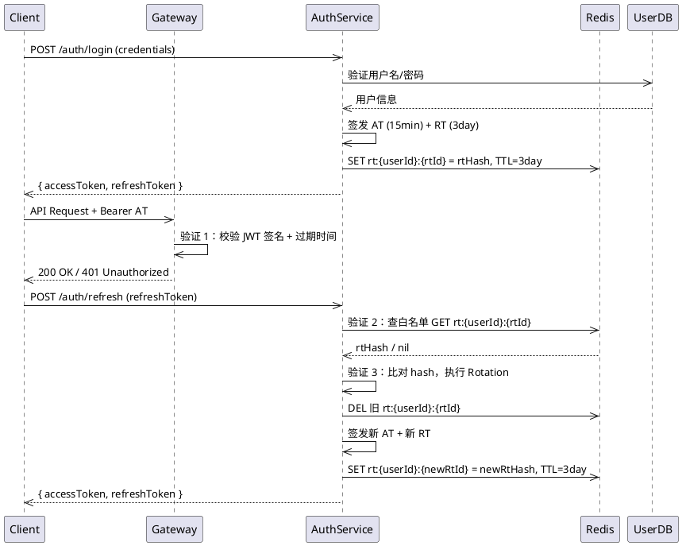
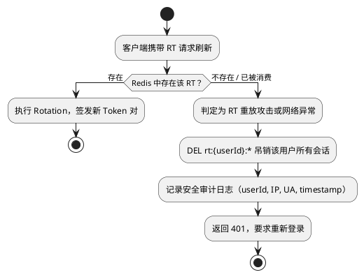

# Software Design Document (SDD)

## 双 Token 三验证认证系统

**版本：​** 1.0.0
**日期：​** 2026-04-26
**状态：​** Draft（本地开发环境）

---

## 1. 概述

### 1.1 目的

本文档描述基于"双 Token + 三验证"模式的高安全认证系统的软件设计方案，供开发 Agent 进行代码生成或系统改造时使用。

### 1.2 范围

覆盖用户登录、Token 签发、Access Token 验证、Refresh Token 轮换（Rotation）、会话吊销等核心认证流程。

### 1.3 术语

| 术语 | 说明 |
|------|------|
| Access Token (AT) | 短期 JWT，用于 API 请求鉴权，有效期 **15 分钟** |
| Refresh Token (RT) | 长期凭证，用于换取新 Token 对，有效期 **3 天** |
| RT Rotation | 每次刷新后旧 RT 立即失效，签发全新 Token 对 |
| Redis 白名单 | 存储有效 RT 的服务端状态，支持主动吊销 |

> **本地环境说明：​** 当前为本机开发环境，HTTPS 暂不可用，使用 HTTP 运行。所有涉及传输安全的约束条目已标注"生产环境启用"，本地开发阶段可跳过。

---

## 2. 系统架构

### 2.1 组件清单

- **Auth Service**：负责登录、Token 签发、Token 刷新、登出
- **API Gateway / Middleware**：负责每次请求的 Access Token 验证（验证 1）
- **Redis**：存储 Refresh Token 白名单，支持 TTL 自动过期与主动删除
- **User DB**：存储用户账号、密码哈希等基础信息

### 2.2 数据流总览



---

## 3. 详细设计

### 3.1 Token 规格

#### Access Token（JWT）

```json
Header:  { "alg": "HS256", "typ": "JWT" }

Payload: {
  "sub":   "<userId>",
  "jti":   "<uuid>",
  "iat":   <issued_at_timestamp>,
  "exp":   <iat + 900>,
  "roles": ["user"]
}
```

#### Refresh Token

Refresh Token 为不透明随机字符串（256-bit 随机字节 Base64URL 编码），不携带业务信息，防止信息泄露。

```
format:  base64url( secureRandom(32 bytes) )
example: "dGhpcyBpcyBhIHNlY3VyZSByZWZyZXNoIHRva2Vu..."
```

### 3.2 Redis 数据结构

```
Key:    rt:{userId}:{rtId}
Value:  SHA-256( refreshToken )     // 存哈希，不存明文
TTL:    259200 秒（3 天）
```

`rtId` 为签发时生成的 UUID，与 RT 字符串绑定，用于精确定位单条记录，支持单设备吊销。

### 3.3 三验证流程

#### 验证 1 — Access Token 校验（每次 API 请求）

执行位置：API Gateway Middleware

```
1. 从 Authorization: Bearer <token> 提取 AT
2. 使用服务端密钥验证 JWT 签名
3. 检查 exp 字段是否已过期
4. 通过 → 放行请求；失败 → 返回 401
```

> 此步骤纯内存计算，不访问 Redis，保证高性能。

#### 验证 2 — Refresh Token 白名单校验

执行位置：Auth Service `/auth/refresh` 接口

```
1. 接收客户端传入的 refreshToken 字符串
2. 计算 SHA-256(refreshToken)，得到 rtHash
3. 从 refreshToken 中解析出 userId 和 rtId
   （rtId 可附加在 RT 字符串中，如 "{rtId}.{randomBytes}"）
4. 查询 Redis: GET rt:{userId}:{rtId}
5. 比对存储的 hash 与计算出的 rtHash 是否一致
6. 不存在或不一致 → 返回 401，触发异常告警
```

#### 验证 3 — Refresh Token Rotation（一次有效）

紧接验证 2 之后，在同一原子操作中执行：

```
1. DEL rt:{userId}:{rtId}          // 旧 RT 立即失效
2. 生成新 AT（exp = now + 900s）
3. 生成新 RT（新 rtId + 新随机字节）
4. SET rt:{userId}:{newRtId} = SHA-256(newRT), TTL=259200
5. 返回新 { accessToken, refreshToken } 给客户端
```

> **原子性要求**：步骤 1~4 必须使用 Redis 事务（MULTI/EXEC）或 Lua 脚本保证原子执行，防止并发竞争导致 RT 被重复消费。

### 3.4 异常检测与全量吊销



### 3.5 主动吊销场景

| 场景 | 操作 |
|------|------|
| 用户主动登出（单设备） | DEL rt:{userId}:{rtId} |
| 用户主动登出（全部设备） | DEL rt:{userId}:* |
| 管理员封禁账号 | DEL rt:{userId}:* + 写入用户封禁标记 |
| 用户修改密码 | DEL rt:{userId}:* + 重新登录签发新 Token |

---

## 4. 接口定义

### POST /auth/login

```
Request:
  Body: { "username": string, "password": string }

Response 200:
  {
    "accessToken":  "<JWT, 15min>",
    "refreshToken": "<opaque string, 3day>",
    "expiresIn":    900
  }

Response 401:
  { "error": "INVALID_CREDENTIALS" }
```

### POST /auth/refresh

```
Request:
  Body: { "refreshToken": string }

Response 200:
  {
    "accessToken":  "<new JWT, 15min>",
    "refreshToken": "<new opaque string, 3day>",
    "expiresIn":    900
  }

Response 401:
  { "error": "INVALID_OR_EXPIRED_REFRESH_TOKEN" }
```

### POST /auth/logout

```
Request:
  Headers: Authorization: Bearer <accessToken>
  Body:    { "refreshToken": string }

Response 204: No Content
```

---

## 5. 安全约束

| 约束项 | 本地开发 | 生产环境 |
|--------|----------|----------|
| 传输协议 | HTTP（暂用） | **HTTPS 强制**（生产环境启用） |
| RT 存储位置 | localStorage 或 Body 均可 | **HttpOnly Cookie**（生产环境启用） |
| Redis 连接认证 | 无密码本地实例可接受 | **AUTH 密码 + TLS**（生产环境启用） |
| AT 签名密钥 | 本地固定字符串可接受 | 从密钥管理服务动态注入，禁止硬编码 |
| 审计日志 | 控制台输出即可 | 持久化至日志系统，保留 ≥ 90 天 |

> **注意：​** 本地使用 HTTP 时，RT 若存于 Cookie 需额外设置 `SameSite=Strict`；若存于请求 Body/LocalStorage，需确保本地网络环境可信，上线前必须切换至 HTTPS + HttpOnly Cookie。

---

## 6. 配置项清单

```yaml
auth:
  access_token_secret: "local-dev-secret-change-in-prod"
  access_token_ttl: 900          # 单位：秒（15 分钟）
  refresh_token_ttl: 259200      # 单位：秒（3 天）
  refresh_token_length: 32       # 随机字节长度

redis:
  host: "127.0.0.1"
  port: 6379
  password: ""                   # 本地开发留空；生产环境必填
  tls: false                     # 本地开发关闭；生产环境设为 true
  key_prefix: "rt:"

server:
  http: true                     # 本地开发启用
  https: false                   # 生产环境设为 true 并配置证书路径
```
