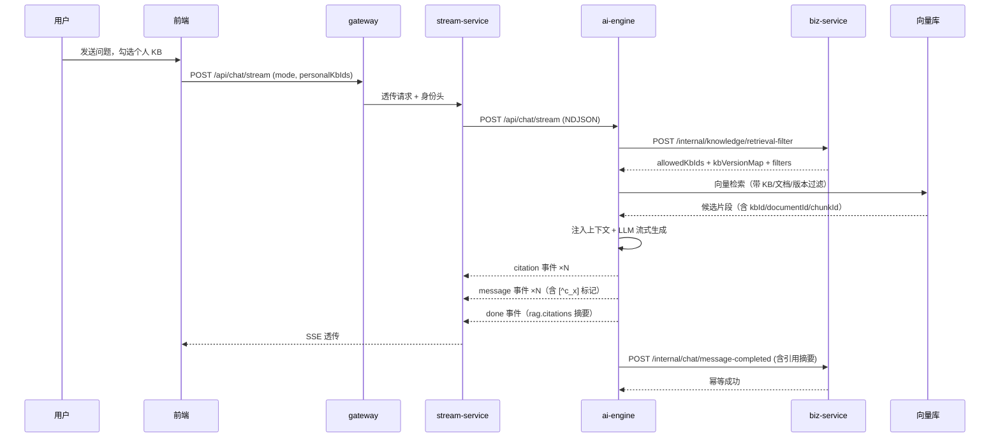
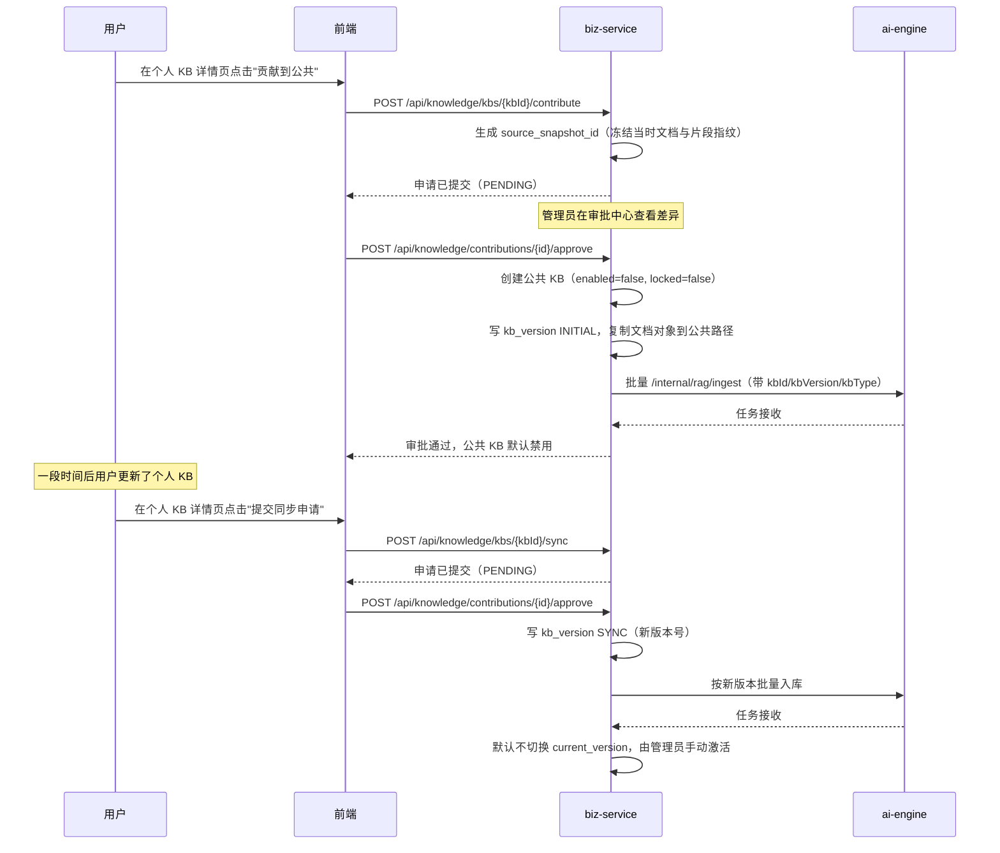

# 智能客服知识库页面交互方案设计文档（SDD）

**版本**：2.0.0
**日期**：2026-04-27
**适用范围**：`biz-service` 知识库管理与 API、`stream-service` 转发契约、`ai-engine` 检索与引用、前端知识库与聊天页面
**核心改动**：从"文档级知识库"升级为"知识库（KB）→ 文档（Document）→ 片段（Chunk）"三层模型；新增贡献快照与版本治理；强制 Agent 输出"知识库 + 文档 + 片段"三级引用

---

## 1. 设计目标

1. **三层模型**：将原有"单文档即一条知识"的扁平结构，升级为"知识库 → 文档 → 片段"三层模型，知识库下可包含多个文档，文档可被增删改查。
2. **公共与个人双轨**：公共知识库（含默认客服案例库）由管理员、超级管理员维护，对全体用户可见；个人知识库由用户自建自管，仅对自己可见。
3. **案例库默认初始化**：系统首次启动时自动创建并初始化"客服案例库"这一公共知识库，默认启用，且其启停只允许超级管理员操作。
4. **管理员统一启停**：公共知识库的启用/禁用由管理员设置，一经设置对所有用户生效；用户在聊天时不能启用被禁用的公共知识库。
5. **聊天侧灵活选择**：用户在智能问答时，公共启用知识库默认参与 RAG，并可额外勾选自己的一个或多个个人知识库作为追加。
6. **贡献快照与版本治理**：个人知识库可整库申请贡献到公共知识库；审批通过后入库的是当时的快照，与原始个人知识库解耦；用户后续可发起"同步申请"提交新版本，由管理员审批后形成新版本，旧版本可保留追溯。
7. **强制三级引用**：Agent 每次基于 RAG 的回答，必须明确给出引用了"哪个知识库 → 哪个文档 → 哪个片段"，并在前端可点击溯源。

---

## 2. 实体模型升级

### 2.1 三层模型与边界

| 层级 | 实体 | 说明 |
|---|---|---|
| L1 知识库 | `kb_knowledge_base` | 一个知识库是一组主题相关文档的集合，是用户启用/禁用与权限控制的最小单位 |
| L2 文档 | `kb_document` | 一个文档归属于某个知识库，是上传、解析、入库、审计的最小单位 |
| L3 片段 | `engine_chunk` + `engine_embedding` | 一个文档解析后产生若干片段，是向量召回与引用的最小单位 |

边界约定：

- 启用/禁用的对象是**知识库**，不是单个文档；管理员不能"只禁用某个文档"，但可以"下线某个文档"使其不进入检索。
- 引用的最小单位是**片段**，即同一文档命中多个片段时必须分别展示。
- 用户聊天时勾选的对象是**知识库**，不是文档；通过知识库间接圈定候选文档与片段。

### 2.2 知识库表 `kb_knowledge_base`

```sql
kb_id              VARCHAR(64)  NOT NULL PRIMARY KEY,
tenant_id          VARCHAR(64)  NOT NULL,
scope              VARCHAR(16)  NOT NULL,        -- PUBLIC / PERSONAL
owner_user_id      VARCHAR(64)  NULL,            -- PUBLIC 必须 NULL，PERSONAL 必须非空
name               VARCHAR(128) NOT NULL,
description        VARCHAR(512),
kb_type            VARCHAR(32)  NOT NULL,        -- CASE_LIBRARY / GENERIC_PUBLIC / PERSONAL
source_kb_id       VARCHAR(64)  NULL,            -- 公共快照来源，指向被贡献的个人 KB
source_version     INTEGER      NULL,            -- 公共快照对应的个人 KB 版本号
current_version    INTEGER      NOT NULL DEFAULT 1,
enabled            BOOLEAN      NOT NULL DEFAULT TRUE,
status             VARCHAR(32)  NOT NULL DEFAULT 'ACTIVE',  -- ACTIVE / ARCHIVED / DELETED
locked             BOOLEAN      NOT NULL DEFAULT FALSE,     -- 客服案例库等系统知识库锁定，禁止删除
created_by         BIGINT       NOT NULL DEFAULT 0,
created_at         TIMESTAMPTZ  NOT NULL DEFAULT CURRENT_TIMESTAMP,
updated_by         BIGINT       NOT NULL DEFAULT 0,
updated_at         TIMESTAMPTZ  NOT NULL DEFAULT CURRENT_TIMESTAMP,
deleted            BOOLEAN      NOT NULL DEFAULT FALSE,
CONSTRAINT ck_kb_owner_scope CHECK (
  (scope = 'PUBLIC'   AND owner_user_id IS NULL) OR
  (scope = 'PERSONAL' AND owner_user_id IS NOT NULL)
)
```

要点：

- `kb_type=CASE_LIBRARY` 表示客服案例库，全局唯一，`locked=true` 不可删除；启停只允许超级管理员。
- `kb_type=GENERIC_PUBLIC` 是普通公共知识库，管理员、超级管理员均可启停。
- `kb_type=PERSONAL` 是个人知识库，仅 owner 可见可管。
- 公共快照知识库通过 `source_kb_id` + `source_version` 与原个人知识库建立追溯关系，但运行时数据完全解耦。

### 2.3 文档表 `kb_document`（在原表基础上调整）

在原 `kb_document` 表基础上：

- 新增 `kb_id VARCHAR(64) NOT NULL`，外键指向所属知识库。
- 移除"文档级 enabled 决定是否进入检索"的语义；保留 `enabled` 仅用于"知识库内部下线某文档"。
- `status` 含义不变（`UPLOADED`、`READY`、`FAILED` 等）。
- 可检索条件升级为：`kb.enabled = true AND kb.status = 'ACTIVE' AND doc.status = 'READY' AND doc.enabled = true`。

### 2.4 知识库版本表 `kb_version`

```sql
version_id         VARCHAR(64)  NOT NULL PRIMARY KEY,
kb_id              VARCHAR(64)  NOT NULL,
version_no         INTEGER      NOT NULL,
version_type       VARCHAR(32)  NOT NULL,   -- INITIAL / CONTRIBUTION / SYNC
source_kb_id       VARCHAR(64)  NULL,
source_version_no  INTEGER      NULL,
note               VARCHAR(512),
created_by         BIGINT       NOT NULL,
created_at         TIMESTAMPTZ  NOT NULL DEFAULT CURRENT_TIMESTAMP,
UNIQUE (kb_id, version_no)
```

每次"贡献通过"或"同步通过"都会在公共快照知识库下生成新版本号；当前对外暴露的检索版本由 `kb_knowledge_base.current_version` 控制。

### 2.5 申请流表 `kb_contribution_application`

```sql
application_id        VARCHAR(64)  NOT NULL PRIMARY KEY,
application_type      VARCHAR(32)  NOT NULL,   -- CONTRIBUTE / SYNC
source_kb_id          VARCHAR(64)  NOT NULL,   -- 个人 KB
source_snapshot_id    VARCHAR(64)  NOT NULL,   -- 申请时刻的个人 KB 快照
target_kb_id          VARCHAR(64)  NULL,       -- CONTRIBUTE 时为空，审批通过后回填；SYNC 必填
applicant_user_id     VARCHAR(64)  NOT NULL,
status                VARCHAR(32)  NOT NULL,   -- PENDING / APPROVED / REJECTED / WITHDRAWN
reason                VARCHAR(1024),
review_comment        VARCHAR(1024),
reviewer_user_id      VARCHAR(64)  NULL,
reviewed_at           TIMESTAMPTZ  NULL,
created_at            TIMESTAMPTZ  NOT NULL DEFAULT CURRENT_TIMESTAMP
```

`source_snapshot_id` 指向"快照清单"，记录申请发起瞬间个人 KB 的文档与片段指纹列表，确保后续审批不受用户继续修改的影响。

---

## 3. 角色与权限矩阵

| 操作 | 普通用户 | 管理员 | 超级管理员 |
|---|---|---|---|
| 浏览公共知识库列表 | ✅ 仅启用项 | ✅ 全部 | ✅ 全部 |
| 创建/删除公共知识库 | ❌ | ✅ | ✅ |
| 启用/禁用普通公共知识库 | ❌ | ✅ | ✅ |
| 启用/禁用客服案例库 | ❌ | ❌ | ✅ |
| 公共知识库下增删改查文档 | ❌ | ✅ | ✅ |
| 创建/删除个人知识库 | ✅ 仅本人 | ✅ 仅本人 | ✅ 仅本人 |
| 个人知识库下增删改查文档 | ✅ 仅本人 | ✅ 仅本人 | ✅ 仅本人 |
| 发起贡献申请 | ✅ | ✅ | ✅ |
| 发起同步申请 | ✅ 仅源 KB owner | ✅ 仅源 KB owner | ✅ 仅源 KB owner |
| 审批贡献/同步申请 | ❌ | ✅ | ✅ |
| 聊天时勾选公共启用 KB | 默认全部参与 | 默认全部参与 | 默认全部参与 |
| 聊天时勾选个人 KB | ✅ 仅自己 | ✅ 仅自己 | ✅ 仅自己 |

权限计算的唯一权威实现仍由 `biz-service` 提供，`ai-engine` 通过 `/internal/knowledge/retrieval-filter` 获取过滤条件，禁止自行判权。

---

## 4. 客服案例库的默认初始化

### 4.1 启动时自检与初始化

`biz-service` 在应用启动后执行一次幂等的"案例库自检"任务：

1. 按 `tenant_id + kb_type=CASE_LIBRARY` 查询是否已存在客服案例库；如不存在则创建：
    - `name` 默认 `客服案例库`，可由租户配置覆盖。
    - `scope=PUBLIC`，`owner_user_id=NULL`，`enabled=true`，`locked=true`，`current_version=1`。
    - 同时写入一条 `kb_version` 记录，`version_type=INITIAL`。
2. 如存在但 `locked=false`，强制修正为 `locked=true`，并写一条审计日志。
3. 如存在但被标记 `deleted=true`，记录告警并阻断启动，提示运维介入；客服案例库不允许被软删。

### 4.2 案例库特殊约束

- 启用/禁用接口对客服案例库返回 `403`，除非调用者是 `SUPER_ADMIN`。
- 删除接口对 `locked=true` 的知识库始终返回 `409`。
- 文档上传遵循"工单结构化分片"规则（沿用 `RAG分片策略设计.md` 第 4 节），与普通公共知识库一致使用 `source_type=CASE_LIBRARY`。

---

## 5. 知识库页面信息架构

整个知识库模块在前端拆分为四个一级 Tab：**公共知识库**、**我的知识库**、**我的申请**、**审批中心**（仅管理员可见）。

### 5.1 公共知识库列表页

页面顶部为筛选条件，列表为知识库卡片，每张卡片展示：

- 知识库名称、描述、类型徽章（`客服案例库` / `公共`）。
- 启用状态开关：管理员可直接切换；客服案例库仅超级管理员可切换，对其他角色显示为"已锁定"灰态。
- 文档数、最近更新时间、当前版本号。
- 二级入口：进入"文档管理"子页。

普通用户视角下：

- 只展示 `enabled=true` 且 `status=ACTIVE` 的公共知识库。
- 没有启用/禁用、删除、上传等管理动作，仅可查看与预览。

### 5.2 知识库详情与文档管理子页

一个知识库详情页是"文档管理 + 版本管理 + 设置"三个子 Tab：

- **文档管理**：列表展示该 KB 下的全部文档，支持搜索、筛选（分类、标签、状态、入库结果）、排序。提供上传、批量上传、编辑元数据、下线、重建索引、删除、预览、查看入库进度等动作；不同角色看到的动作按权限矩阵裁剪。
- **版本管理**：仅公共快照知识库展示，列出 `INITIAL / CONTRIBUTION / SYNC` 历史版本，支持查看版本差异（新增/修改/删除文档清单）、切换"对外检索版本"。
- **设置**：基础元数据（名称、描述、分类）、启用/禁用、锁定标记（只读展示）、归档与删除入口。

### 5.3 我的知识库页

展示当前用户的全部个人知识库，每张卡片支持：

- 进入文档管理（与公共版一致，只是 scope 不同）。
- "贡献到公共知识库"入口；如已存在快照公共 KB，则该入口变为"提交同步申请"。
- 删除个人知识库：会一并解绑已发起但未审批的申请。

### 5.4 我的申请页

按状态分组展示用户发起的全部"贡献 / 同步"申请：

- `PENDING`：可撤回。
- `APPROVED`：展示生成或更新到的公共 KB、版本号、生效状态（默认禁用）。
- `REJECTED`：展示审批意见，支持二次修改后重新发起。

### 5.5 审批中心页（管理员）

展示全部 `PENDING` 申请，每条记录提供：

- 差异预览：申请快照与目标公共 KB 当前版本的文档级差异（新增/修改/删除）。
- 抽样片段预览：点击文档可直接看到关键片段，便于审核内容。
- 批准 / 拒绝 / 退回修改三种处置；批准时强制确认"快照默认禁用"。

---

## 6. 后端 API 规范

所有路径仍通过 `gateway-service` 暴露，路径前缀为 `/api/knowledge/**`，统一遵循 `biz-service` 的身份头与响应规范。

### 6.1 知识库管理 API

| 方法 | 路径 | 权限 | 说明 |
|---|---|---|---|
| `GET` | `/api/knowledge/kbs?scope=PUBLIC` | 登录用户 | 公共 KB 列表，普通用户只见启用项 |
| `GET` | `/api/knowledge/kbs?scope=PERSONAL` | 本人 | 自己的个人 KB 列表 |
| `POST` | `/api/knowledge/kbs` | 公共需 ADMIN，个人需本人 | 创建 KB |
| `GET` | `/api/knowledge/kbs/{kbId}` | 有权访问者 | KB 详情 |
| `PUT` | `/api/knowledge/kbs/{kbId}` | 公共需 ADMIN，个人需本人 | 编辑 KB 元数据 |
| `DELETE` | `/api/knowledge/kbs/{kbId}` | 公共需 ADMIN，个人需本人 | 删除 KB；`locked=true` 拒绝 |
| `POST` | `/api/knowledge/kbs/{kbId}/enable` | 普通公共：ADMIN；案例库：SUPER_ADMIN | 启用 KB |
| `POST` | `/api/knowledge/kbs/{kbId}/disable` | 普通公共：ADMIN；案例库：SUPER_ADMIN | 禁用 KB |
| `GET` | `/api/knowledge/kbs/{kbId}/versions` | 有权访问者 | 版本列表 |
| `POST` | `/api/knowledge/kbs/{kbId}/versions/{versionNo}/activate` | ADMIN | 切换对外检索版本 |

KB 启用/禁用接口在内部仅修改 `kb.enabled`，不改变文档状态；`selectable` 与检索过滤条件解析自动跟随。

### 6.2 文档管理 API

| 方法 | 路径 | 权限 | 说明 |
|---|---|---|---|
| `GET` | `/api/knowledge/kbs/{kbId}/documents` | 有权访问者 | 文档列表 |
| `POST` | `/api/knowledge/kbs/{kbId}/documents` | 公共需 ADMIN，个人需本人 | 上传文档（multipart） |
| `GET` | `/api/knowledge/kbs/{kbId}/documents/{documentId}` | 有权访问者 | 文档详情 |
| `PUT` | `/api/knowledge/kbs/{kbId}/documents/{documentId}` | 公共需 ADMIN，个人需本人 | 编辑元数据 |
| `DELETE` | `/api/knowledge/kbs/{kbId}/documents/{documentId}` | 公共需 ADMIN，个人需本人 | 删除文档 |
| `POST` | `/api/knowledge/kbs/{kbId}/documents/{documentId}/disable` | 公共需 ADMIN，个人需本人 | 文档下线 |
| `POST` | `/api/knowledge/kbs/{kbId}/documents/{documentId}/enable` | 公共需 ADMIN，个人需本人 | 文档上线 |
| `POST` | `/api/knowledge/kbs/{kbId}/documents/{documentId}/reindex` | 公共需 ADMIN，个人需本人 | 重建索引 |
| `GET` | `/api/knowledge/kbs/{kbId}/documents/{documentId}/preview` | 有权访问者 | 预览原文 |
| `GET` | `/api/knowledge/kbs/{kbId}/documents/{documentId}/chunks` | 有权访问者 | 查看片段，便于审计 |
| `GET` | `/api/knowledge/kbs/{kbId}/documents/{documentId}/ingestion` | 有权访问者 | 入库任务状态 |

文档上线/下线只影响 `doc.enabled`，知识库整体启用状态优先于文档级控制：KB 被禁用时文档无论上下线均不进入检索。

### 6.3 贡献与同步 API

| 方法 | 路径 | 权限 | 说明 |
|---|---|---|---|
| `POST` | `/api/knowledge/kbs/{kbId}/contribute` | 个人 KB owner | 发起贡献申请 |
| `POST` | `/api/knowledge/kbs/{kbId}/sync` | 个人 KB owner | 发起同步申请，要求该个人 KB 已有公共快照 |
| `GET` | `/api/knowledge/contributions/mine` | 本人 | 我的申请 |
| `POST` | `/api/knowledge/contributions/{applicationId}/withdraw` | 申请人 | 撤回 PENDING 申请 |
| `GET` | `/api/knowledge/contributions/pending` | ADMIN | 待审申请 |
| `GET` | `/api/knowledge/contributions/{applicationId}/diff` | ADMIN 或申请人 | 申请快照与目标 KB 当前版本差异 |
| `POST` | `/api/knowledge/contributions/{applicationId}/approve` | ADMIN | 通过；首次贡献创建公共 KB，同步申请生成新版本 |
| `POST` | `/api/knowledge/contributions/{applicationId}/reject` | ADMIN | 拒绝，必填意见 |

审批通过处理器约束：

- 首次贡献通过：在公共域创建一个新 `kb_knowledge_base`，`kb_type=GENERIC_PUBLIC`，`source_kb_id` 与 `source_version` 指向当时的个人 KB 快照，`enabled=false` 必须由处理器显式写入，不依赖默认值；写入 `kb_version` `INITIAL` 记录。
- 同步申请通过：复用既有公共 KB；将快照内容覆盖式写入新版本（新建 `kb_version` `SYNC`），`current_version` 是否切换由审批人选择，默认不自动切换，避免在管理员未确认前对外曝光新版本。
- 处理器必须把"创建/更新文档、生成片段、调用 `ai-engine` 入库"作为同一逻辑事务的不同步骤，任意失败回滚到本次版本之前的状态。
- 拒绝时只更新申请记录，不影响公共 KB 与个人 KB。

### 6.4 聊天侧选择与过滤

```text
GET /api/knowledge/selectable
```

升级后的响应以"知识库"为主语：

```json
{
  "publicKbs": [
    {
      "kbId": "kb_case_default",
      "name": "客服案例库",
      "kbType": "CASE_LIBRARY",
      "enabled": true,
      "locked": true,
      "documentCount": 128,
      "currentVersion": 1
    },
    {
      "kbId": "kb_after_sales",
      "name": "售后政策库",
      "kbType": "GENERIC_PUBLIC",
      "enabled": true,
      "documentCount": 32,
      "currentVersion": 3
    }
  ],
  "personalKbs": [
    {
      "kbId": "kb_personal_u001_notes",
      "name": "我的售后笔记",
      "documentCount": 6,
      "hasPublicSnapshot": true,
      "publicSnapshotKbId": "kb_after_sales_u001"
    }
  ],
  "policy": {
    "publicAlwaysOn": true,
    "personalSelectable": true
  }
}
```

`selectable` 响应规则：

- `publicKbs` 中只返回 `enabled=true AND status=ACTIVE` 的公共知识库；管理员视角下也按此规则返回，避免管理员的聊天会话引入被禁用知识库。
- `personalKbs` 仅返回当前用户自己的、`status=ACTIVE` 的个人知识库；用户在聊天页可勾选若干个作为追加。
- 公共启用知识库默认全部参与 RAG，前端无需勾选；策略 `publicAlwaysOn=true` 用于提示前端"公共部分不可取消，只能取消个人部分"。
- 当用户希望"本次问答不使用任何知识库"时，发送 `mode=NONE`，跳过 RAG。

聊天请求体中的 `knowledgeSelection` 升级为知识库维度：

```json
{
  "mode": "DEFAULT",
  "personalKbIds": ["kb_personal_u001_notes"]
}
```

`mode` 取值：

| mode | 公共启用 KB | 个人 KB | 说明 |
|---|---|---|---|
| `DEFAULT` | 全部参与 | 按 `personalKbIds` 取并集 | 默认推荐模式 |
| `PUBLIC_ONLY` | 全部参与 | 不参与 | 只用公共启用 KB |
| `PERSONAL_ONLY` | 不参与 | 按 `personalKbIds` 取并集 | 只用所选个人 KB |
| `NONE` | 不参与 | 不参与 | 跳过 RAG |

### 6.5 检索过滤条件解析升级

```text
POST /internal/knowledge/retrieval-filter
```

响应体改为以 KB 为权威边界：

```json
{
  "mode": "DEFAULT",
  "skipRetrieval": false,
  "tenantId": "default",
  "allowedKbIds": ["kb_case_default", "kb_after_sales", "kb_personal_u001_notes"],
  "filters": {
    "status": "READY",
    "docEnabled": true,
    "kbEnabled": true,
    "kbStatus": "ACTIVE",
    "tenantId": "default",
    "publicOwnerIsNull": true,
    "personalOwnerUserId": "u_001",
    "kbVersionMap": {
      "kb_after_sales": 3,
      "kb_case_default": 1
    }
  },
  "deniedCandidates": [
    {"kbIdHash": "sha256:...", "scope": "PERSONAL", "reason": "OWNER_MISMATCH"}
  ]
}
```

新增规则：

- 候选集合先按 `allowedKbIds` 缩小，再叠加 `kb.enabled=true AND kb.status=ACTIVE AND doc.status=READY AND doc.enabled=true`。
- 公共快照 KB 必须按 `kbVersionMap` 中的版本号过滤片段，旧版本片段在向量库以版本字段标记，不混入当前检索。
- `PERSONAL` 仅允许 `owner_user_id = 当前用户`；越权个人 KB 进入 `deniedCandidates` 并脱敏。
- `ai-engine` 仅按响应体执行向量元数据过滤，禁止自行补充任何业务规则。

---

## 7. RAG 分片与元数据升级

为支持"知识库 → 文档 → 片段"的三级引用与版本治理，`engine_chunk` 和 `engine_embedding` 必须扩展元数据。

### 7.1 片段表新增字段

```sql
ALTER TABLE engine_chunk ADD COLUMN kb_id        VARCHAR(64) NOT NULL;
ALTER TABLE engine_chunk ADD COLUMN kb_version   INTEGER     NOT NULL DEFAULT 1;
ALTER TABLE engine_chunk ADD COLUMN kb_type      VARCHAR(32) NOT NULL;
CREATE INDEX idx_engine_chunk_kb ON engine_chunk (kb_id, kb_version) WHERE deleted = FALSE;
```

写入约束：

- 入库时由 `biz-service` 在调用 `/internal/rag/ingest` 时显式传入 `kbId`、`kbVersion`、`kbType`，`ai-engine` 写入每个片段的 metadata 与字段。
- 同一个文档在不同版本的公共快照 KB 中独立产出片段，不复用旧版本向量；删除版本时按 `kb_id + kb_version` 范围批量清理。

### 7.2 入库请求扩展

`biz-service -> ai-engine` 的 `/internal/rag/ingest` 请求体新增字段：

```json
{
  "taskId": "kb_task_001",
  "documentId": "doc_public_001",
  "kbId": "kb_after_sales",
  "kbVersion": 3,
  "kbType": "GENERIC_PUBLIC",
  "scope": "PUBLIC",
  "tenantId": "default",
  "ownerUserId": null,
  "objectPath": "kb/public/kb_after_sales/v3/doc_public_001/manual.pdf",
  "title": "售后政策手册",
  "sourceType": "PDF",
  "traceId": "trace-001"
}
```

`ai-engine` 在写片段时将上述字段透传到 metadata，并填入 `kb_id`、`kb_version` 列。

### 7.3 检索响应携带三级标识

`/internal/rag/retrieve` 与普通聊天链路的内部召回结果，每个片段必须返回：

```json
{
  "chunkId": "chk_001",
  "parentChunkId": "par_001",
  "kbId": "kb_after_sales",
  "kbName": "售后政策库",
  "kbVersion": 3,
  "documentId": "doc_public_001",
  "documentTitle": "售后政策手册",
  "sectionPath": ["退款规则", "到账时间"],
  "snippet": "退款审核通过后通常 1-3 个工作日到账。",
  "score": 0.82,
  "position": {"page": 3, "charStart": 1200, "charEnd": 1460}
}
```

`kbName`、`documentTitle` 由 `ai-engine` 在生成回答前从 `biz-service` 缓存或随入库一起冗余存储，避免每次检索都跨服务回查。

---

## 8. Agent 强制三级引用

### 8.1 引用契约

Agent 每次基于 RAG 的回答，必须输出"知识库 → 文档 → 片段"三级引用。引用通过流式 `citation` 事件下发，并在 `done` 事件中聚合摘要。

`citation` 事件结构：

```json
{
  "event": "citation",
  "data": {
    "citationId": "c_1",
    "kbId": "kb_after_sales",
    "kbName": "售后政策库",
    "kbType": "GENERIC_PUBLIC",
    "kbVersion": 3,
    "documentId": "doc_public_001",
    "documentTitle": "售后政策手册",
    "chunkId": "chk_001",
    "parentChunkId": "par_001",
    "sectionPath": ["退款规则", "到账时间"],
    "snippet": "退款审核通过后通常 1-3 个工作日到账。",
    "score": 0.82,
    "anchor": {"page": 3, "charStart": 1200, "charEnd": 1460}
  }
}
```

`message` 事件中的正文必须使用 `[^c_1]` 这类引用标记与 `citationId` 对齐，便于前端把行内角标渲染为可点击的引用。

`done.data` 中聚合：

```json
{
  "finishReason": "stop",
  "rag": {
    "used": true,
    "citationCount": 3,
    "kbCount": 2,
    "citations": ["c_1", "c_2", "c_3"]
  }
}
```

### 8.2 强制约束

- 当本轮命中 RAG 候选并把任一片段注入 LLM 上下文时，最终回答**必须**至少包含一条 `citation`，且回答正文必须出现至少一个对应 `citationId` 的引用标记；否则 `ai-engine` 在 `done` 之前生成 `error` 事件，`finishReason=citation_missing`，由前端提示"引用缺失，已阻断"。
- 当本轮未命中任何 RAG 候选（`mode=NONE`、`skipRetrieval=true`、检索为空）时，回答必须以"未引用知识库"的明确话术开头，并在 `done.rag.used=false` 中标记，禁止伪造引用。
- 引用片段必须真实参与了上下文注入；`ai-engine` 必须在 `engine_retrieval_log` 与 `engine_quality_event` 中保存"被注入的 chunkId 列表"和"最终回答中出现的 citationId 列表"，做一致性核对。
- 同一文档命中多个片段时，必须分别下发 `citation`，不允许聚合为一条"文档级引用"，确保用户可以点击到具体片段。
- `kbId`、`documentId`、`chunkId` 三者必须同时出现，缺一即视为无效引用并被丢弃。
- 个人知识库引用展示"个人"徽章，公共快照 KB 引用展示"公共（来自我的贡献）"徽章，便于用户分辨数据来源。

### 8.3 前端引用渲染

- 行内角标点击后展开侧边抽屉，按"知识库 → 文档 → 片段"三级面包屑展示，附带原文片段、相似度分数与"在文档中定位"按钮。
- 抽屉中提供"反馈不准确""无关命中"按钮，触发后写入 `engine_quality_event`，用于知识库召回质量评估。
- 公共快照 KB 引用额外展示"当前对外版本号"与"快照来源"，以解释为何与原个人 KB 内容存在差异。

---

## 9. stream-service 与契约同步

`stream-service` 仍保持"纯流式转发"职责，不解析业务字段，但需要把升级后的字段原样透传：

- 请求体中 `knowledgeSelection` 升级为 `mode + personalKbIds` 结构，`stream-service` 不解释字段含义，按原样转发到 `ai-engine`。
- 响应侧 `citation` 事件由 `ai-engine` 输出 NDJSON，`stream-service` 仅做 NDJSON → SSE 的格式转换；`citation.data` 中的三级标识不得被截断、聚合或重写。
- 当 `ai-engine` 发出 `error` 事件 `finishReason=citation_missing` 时，`stream-service` 必须先转发 `error`，再转发 `done`，最后关闭连接，前端据此提示"引用缺失，已阻断本次回答"。

---

## 10. 关键交互时序

### 10.1 聊天 + RAG + 三级引用



### 10.2 个人 KB 贡献与同步



---

## 11. 安全、审计与可观测性

- 所有 KB 启停、文档上下线、贡献审批、版本切换操作必须写入 `kb_operation_log`，并记录操作者、目标 KB/版本、前后状态。
- 越权访问个人 KB 的检索请求由 `biz-service` 解析阶段拦截，并在 `engine_retrieval_log` 写入 `access_denied` 安全审计；日志中只保存哈希后的 `kbId/documentId`，不写正文。
- Agent 的引用一致性核对作为旁路指标，每日聚合"召回片段数 / 引用片段数 / 缺失引用回答数"，触发阈值告警。
- 公共快照 KB 与原个人 KB 必须保持物理隔离：MinIO 路径前缀分别为 `kb/public/{kbId}/v{version}/...` 与 `kb/personal/{userId}/{kbId}/...`，禁止跨路径软链接。
- 客服案例库的所有写操作必须由超级管理员或经其授权的管理员执行，并按租户独立审计。

---

## 12. 落地路线建议

1. **第一阶段（结构升级）​**：建表 `kb_knowledge_base`、`kb_version`，迁移现有 `kb_document` 增加 `kb_id`，为每个旧文档分配默认知识库（公共类按分类聚合，个人类按用户聚合）；落地客服案例库初始化任务。
2. **第二阶段（API 与页面）​**：上线 KB 与文档两层 API、前端四个 Tab、聊天侧 `selectable` 与 `knowledgeSelection` 升级。
3. **第三阶段（贡献与版本）​**：上线贡献/同步申请流、版本管理、差异预览，并把入库链路改造为 KB+版本维度。
4. **第四阶段（强制引用）​**：在 `ai-engine` 实施三级引用契约，前端实现行内角标与抽屉，建立"引用缺失阻断"质量门。
5. **第五阶段（治理与质量）​**：补齐审计、质量评估、版本回滚演练，沉淀知识库治理 SOP。
